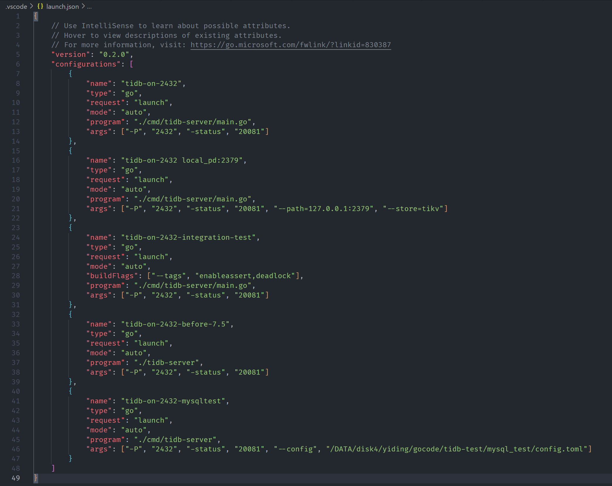

# Run and debug integration tests

TiDB now has some integration tests inside the folder `tests/integrationtest`. Those tests are simply organized as SQL files. The test inputs are put in the folder `t/` and the pre-stored result files are in the folder `r/`.

# How to run integration tests

Once you have built a TiDB binary. You can go to the folder `tests/integrationtest` and run `./run-tests.sh -s ../../bin/tidb-server` to run all the integration tests.

And you can use `-t` to specify a test file to test. If you run `./run-tests.sh -s ../../bin/tidb-server -t executor/simple`, the scripts will run the tests inside the file `t/executor/simple.test`.(It's corresponding result file is `r/executor/simple.result`)

If you find out that the changes of tests are expected, you can pass `-r` to re-generate the result file. If you run `./run-tests.sh -s ../../bin/tidb-server -r executor/simple`, it will overwirte the `r/executor/simple.test` by the new binary.

# How to debug integration tests

Sometimes you will need to debug the test when you find out that some changes are not expected. You will need to do some preparation before attach to `dlv` if you prefer to use `dlv` to do live debugging.

We use some build tags to inject some check in the testing environment. Those tags are `intest,deadlock,integrationtest`, so you need to pass `--tags intest,deadlock,integrationtest` when you're building the binary. Or you can directly run `make server_check` to build the needed binary and then use `dlv` to do the debugging.

After you build the correct binary, you can follow the descriptions in [Use delve for debugging](./debug-and-profile.md#use-delve-for-debugging) to debug TiDB.

## How to use IDE to debug

If you're using IDEs, you'll need to create a special build file for it.

### Visual Studio Code

Find the `Run and Debug` in the left sidebar. If you haven't created any config, click the `create a launch.json file.`

And then you are able to create different run&debug configurations.

The above image shows some samples of the configuration. And the `tidb-on-2432-integration-test` is the one enabling build tags.

Then you just need to click the run button, VS Code will build the binary and then use `dlv` to attach on it.

You can find more about VS Code's debugging on its official documents.