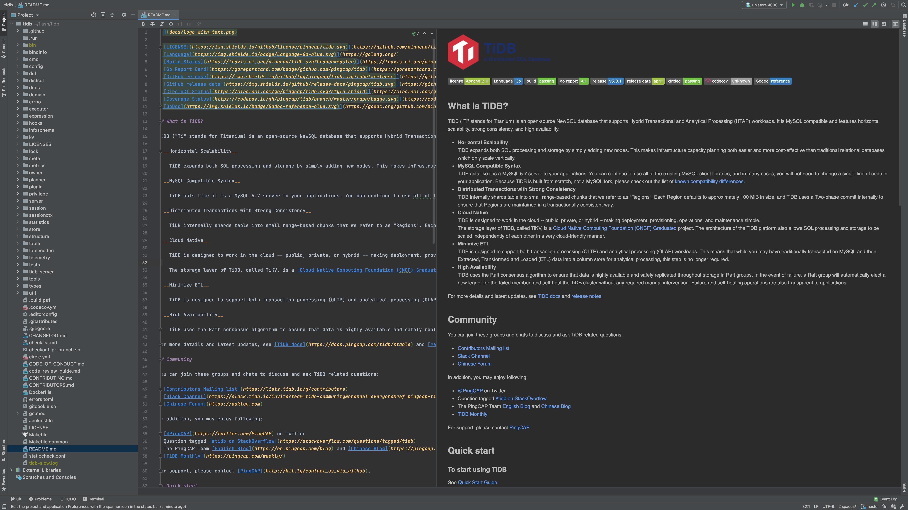
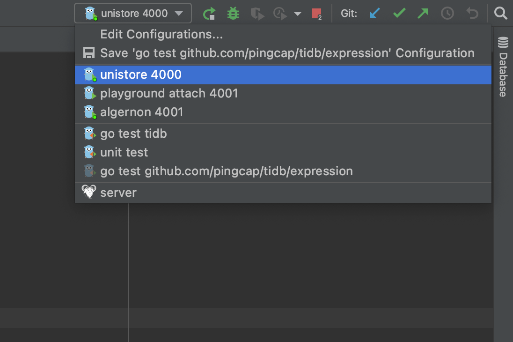
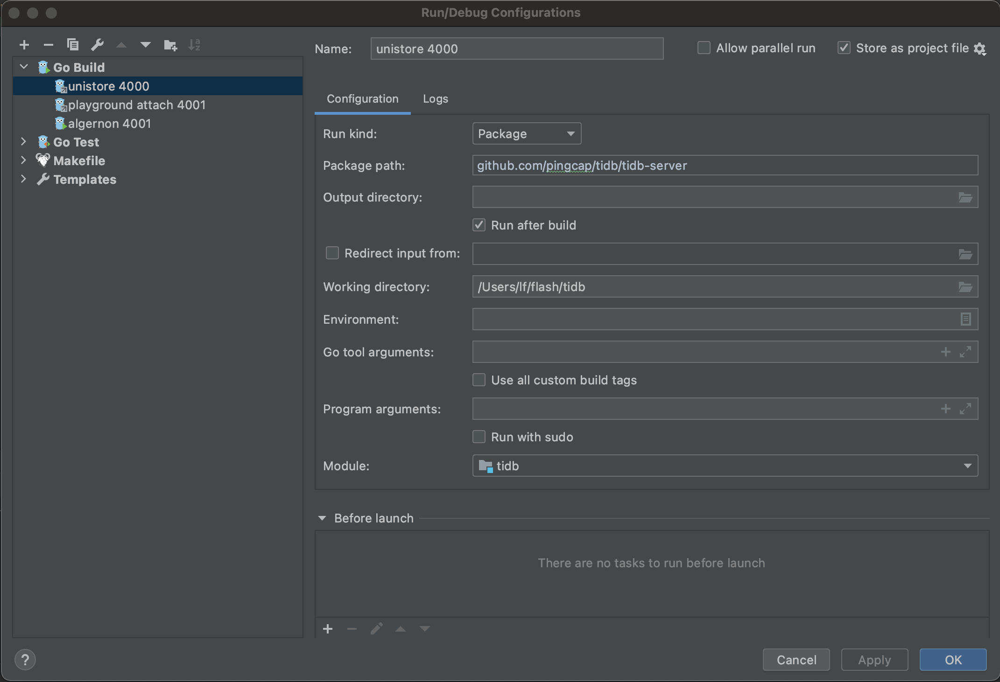
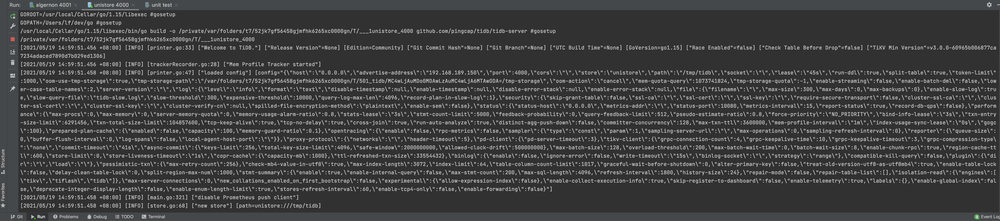
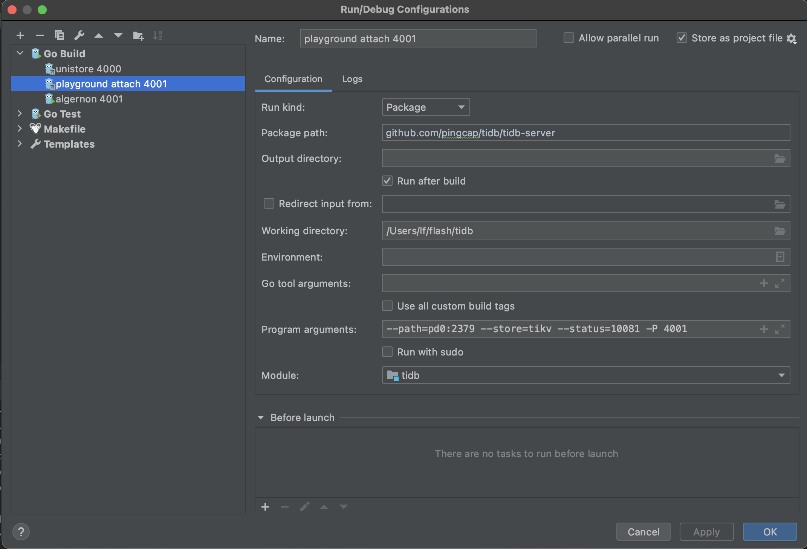
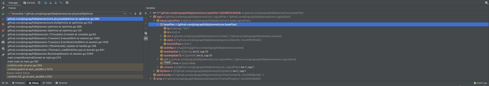
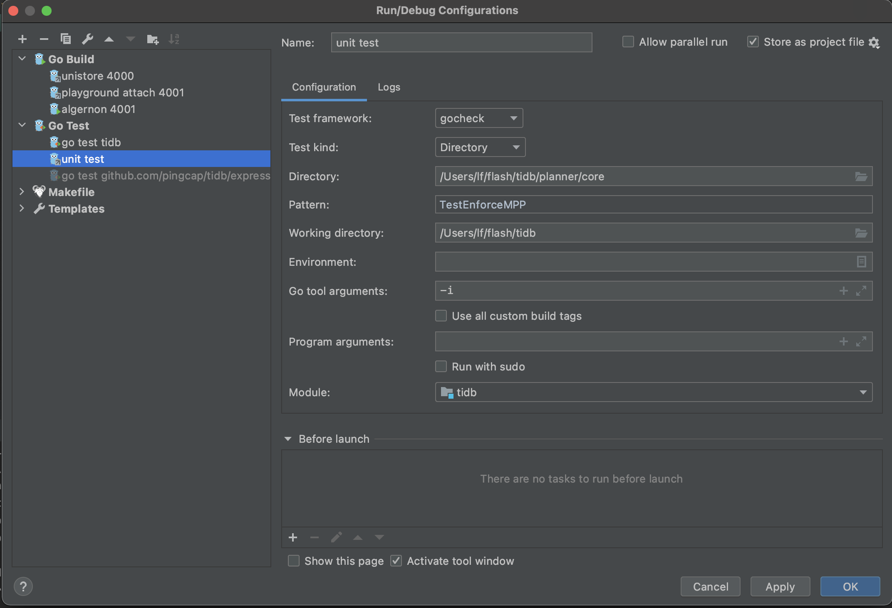
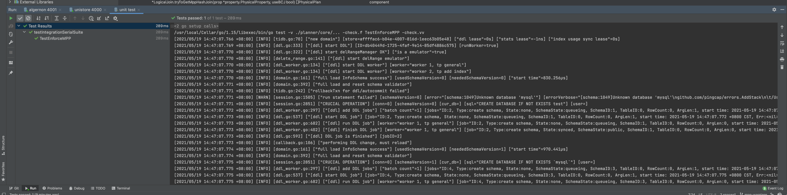
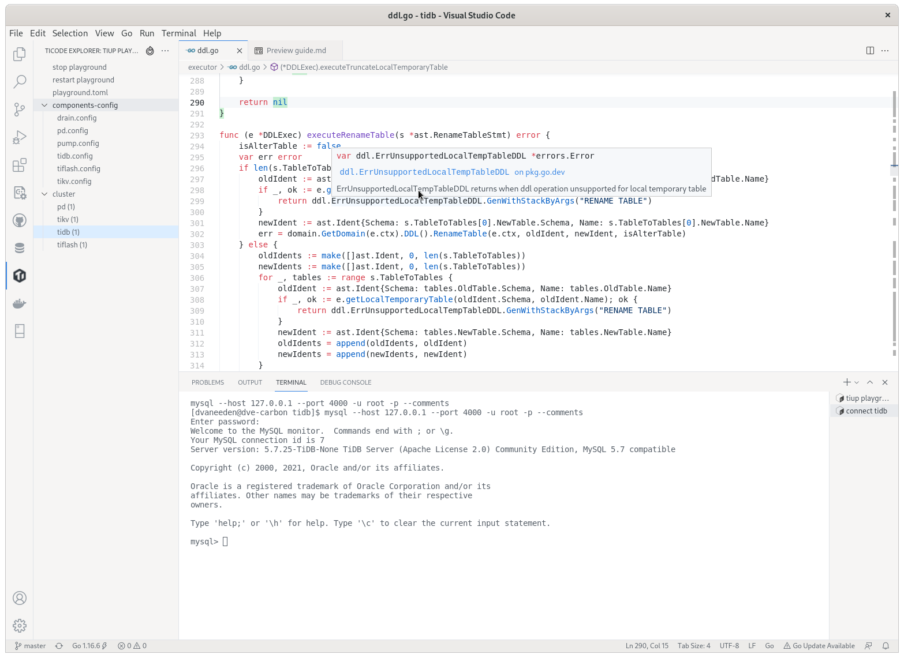

# Setup an IDE

Using an IDE is recommended as it makes it a lot easier to for example see the fields of a struct. However it is not required to use a specic IDE or editor.

## GoLand

You can use [GoLand](https://www.jetbrains.com/go/) to easily run or debug TiDB in many situations.

### Prerequisites

* `go`: TiDB is a Go project thus its building requires a working `go` environment. See the previous [Install Golang](install-golang.md) section to prepare the environment.
* TiDB source code: See the previous [Get the code, build and run](build-tidb-from-source.md) section to get the source code.

### Download GoLand

Download GoLand from [here](https://www.jetbrains.com/go/download) and install it.

### Open TiDB source code in GoLand

Follow the [instruction](https://www.jetbrains.com/help/go/quick-start-guide-goland.html#open-project) and open TiDB source code in GoLand.



### Populate Run Configurations

Execute the following commands under the root dir of TiDB source code to add config files.

```bash
mkdir -p .idea/runConfigurations/ && cd .idea/runConfigurations/

cat <<EOF > unistore_4000.xml
<component name="ProjectRunConfigurationManager">
  <configuration default="false" name="unistore 4000" type="GoApplicationRunConfiguration" factoryName="Go Application">
    <module name="tidb" />
    <working_directory value="\$PROJECT_DIR\$" />
    <kind value="PACKAGE" />
    <filePath value="\$PROJECT_DIR\$" />
    <package value="github.com/pingcap/tidb/tidb-server" />
    <directory value="\$PROJECT_DIR\$" />
    <method v="2" />
  </configuration>
</component>
EOF

cat <<EOF > playground_attach_4001.xml
<component name="ProjectRunConfigurationManager">
  <configuration default="false" name="playground attach 4001" type="GoApplicationRunConfiguration" factoryName="Go Application">
    <module name="tidb" />
    <working_directory value="\$PROJECT_DIR\$" />
    <parameters value="--path=127.0.0.1:2379 --store=tikv --status=10081 -P 4001 " />
    <kind value="PACKAGE" />
    <filePath value="\$PROJECT_DIR\$/tidb-server/main.go" />
    <package value="github.com/pingcap/tidb/tidb-server" />
    <directory value="\$PROJECT_DIR\$" />
    <method v="2" />
  </configuration>
</component>
EOF

cat <<EOF > unit_test.xml
<component name="ProjectRunConfigurationManager">
  <configuration default="false" name="unit test" type="GoTestRunConfiguration" factoryName="Go Test">
    <module name="tidb" />
    <working_directory value="\$PROJECT_DIR\$" />
    <go_parameters value="-i" />
    <framework value="gocheck" />
    <kind value="DIRECTORY" />
    <package value="github.com/pingcap/tidb" />
    <directory value="\$PROJECT_DIR\$/planner/core" />
    <filePath value="\$PROJECT_DIR\$" />
    <pattern value="TestEnforceMPP" />
    <method v="2" />
  </configuration>
</component>
EOF
```

Now please confirm there are three config files.

```bash
ls
# OUTPUT:
# playground_attach_4001.xml
# unistore_4000.xml
# unit_test.xml
```

### Run or Debug

Now you can see the run/debug configs right upper the window.



The first config is `unistore 4000`, which enables you run/debug TiDB independently without TiKV, PD, and TiFlash.




The second config is `playground attach 4001`, which enables you can run/debug TiDB by attaching to an existing cluster; for example, a cluster deployed with [`tiup playground`](https://docs.pingcap.com/tidb/stable/tiup-playground).

After it started, you can connect to the origin TiDB by port 4000, or connect to your TiDB by port 4001 at the same time.




The third config is `unit test`, which enables you can run/debug unit tests. You may modify the `Directory` and `Pattern` to run other tests.




If you encounter any problems during your journey, do not hesitate to reach out on the [TiDB Internals forum](https://internals.tidb.io/).

## Visual Studio Code

VS Code is a generic IDE that has good extensions for working with Go and TiDB.



### Prerequisites

* `go`: TiDB is a Go project thus its building requires a working `go` environment. See the previous [Install Golang](install-golang.md) section to prepare the environment.
* TiDB source code: See the previous [Get the code, build and run](build-tidb-from-source.md) section to get the source code.

### Download VS Code

Download VS Code from [here](https://code.visualstudio.com/Download) and install it.

Now install these extensions:

* [Go](https://marketplace.visualstudio.com/items?itemName=golang.Go)
* [TiDE](https://marketplace.visualstudio.com/items?itemName=dragonly.ticode)
* [GitHub Pull Requests and Issues](https://marketplace.visualstudio.com/items?itemName=github.vscode-pull-request-github)

### Work with TiDB code in VS Code

Open the folder containing TiDB code via `File→Open Folder`. See the [VS Code docs](https://code.visualstudio.com/docs) for how to edit and commit code.

There is [detailed guide](https://github.com/tidb-incubator/tide/blob/HEAD/doc/guide.md) explaining how to use the TiDE extension.