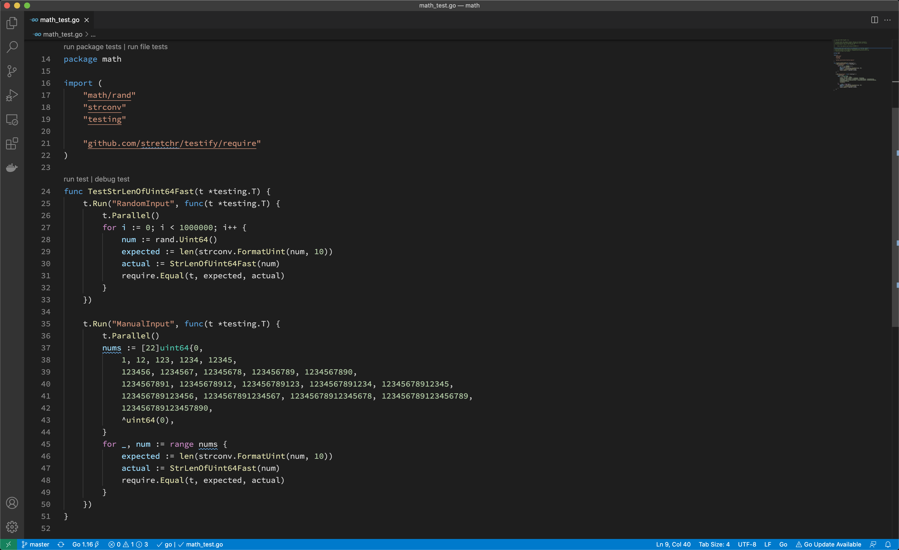

# Write and run unit tests

The TiDB project runs unit tests using [testify](https://github.com/stretchr/testify).

You may find tests using [pingcap/check](http://github.com/pingcap/check) which is a fork of [go-check/check](https://github.com/go-check/check), but since that framework is poorly maintained, we are migrating to testify.

You can check the background and progress on the migration [tracking issue](https://github.com/pingcap/tidb/issues/26022).

## How to write unit tests

We use testify to write unit tests. Basically, it is out-of-the-box [testing](https://pkg.go.dev/testing) with testify assertions.

### TestMain

When you run tests, Golang compiles each package along with any files with names with suffix `_test.go`. Thus, a test binary contains tests in a package.

Golang testing provides a mechanism to support doing extra setup or teardown before or after testing by writing a package level unique function:

```go
func TestMain(m *testing.M)
```

After all tests finish, we leverage the function to detect Goroutine leaks by [goleak](https://github.com/uber-go/goleak).

Before you write any unit tests in a package, create a file named `main_test.go` and setup the scaffolding:

```go
func TestMain(m *testing.M) {
    goleak.VerifyTestMain(m)
}
```

You can also put global variables or helper functions of the test binary in this file.

### Assertion

Let's write a basic test for the utility function `StrLenOfUint64Fast`:

```go
func TestStrLenOfUint64Fast(t *testing.T) {
    for i := 0; i < 1000000; i++ {
        num := rand.Uint64()
        expected := len(strconv.FormatUint(num, 10))
        actual := StrLenOfUint64Fast(num)
        require.Equal(t, expected, actual)
    }
}
```

Golang testing detects test functions from `*_test.go` files of the form:

```go
func TestXxx(*testing.T)
```

where `Xxx` does not start with a lowercase letter. The function name identifies the test routine.

We follow this pattern but use testify assertions instead of out-of-the-box methods, like `Error` or `Fail`, since they are too low level to use.

We mostly use `require.Xxx` for assertions, which is imported from `github.com/stretchr/testify/require`. If the assertions fail, the test fails immediately, and we tend to fail tests fast.

Below are the most frequently used assertions:

```go
func Equal(t TestingT, expected interface{}, actual interface{}, msgAndArgs ...interface{})
func EqualValues(t TestingT, expected interface{}, actual interface{}, msgAndArgs ...interface{})
func Len(t TestingT, object interface{}, length int, msgAndArgs ...interface{})
func Nil(t TestingT, object interface{}, msgAndArgs ...interface{})
func NoError(t TestingT, err error, msgAndArgs ...interface{})
func NotNil(t TestingT, object interface{}, msgAndArgs ...interface{})
func True(t TestingT, value bool, msgAndArgs ...interface{})
```

You can find other assertions follow the [documentation](https://pkg.go.dev/github.com/stretchr/testify/require).

### Parallel

Golang testing provides a method of `testing.T` to run tests in parallel:

```go
t.Parallel()
```

We leverage this function to run tests as parallel as possible, so that we make full use of the available resource.

When some tests should be run in serial, use Golang testing [subtests](https://pkg.go.dev/testing#hdr-Subtests_and_Sub_benchmarks) and parallel the parent test only. In this way, tests in the same subtests set run in serial.

```go
func TestParent(t *testing.T) {
    t.Parallel()
    // <setup code>
    t.Run("Serial 0", func(t *testing.T) { ... })
    t.Run("Serial 1", func(t *testing.T) { ... })
    t.Run("Serial 2", func(t *testing.T) { ... })
    // <tear-down code>
}
```

Generally, if a test modifies global configs or fail points, it should be run in serial.

When writing parallel tests, there are several common considerations.

In Golang, the loop iterator variable is a single variable that takes different value in each loop iteration. Thus, when you run this code it is highly possible to see the last element used for every iteration. You may use below paradigm to work around.

```go
func TestParallelWithRange(t *testing.T) {
    for _, test := range tests {
        // copy iterator variable into a new variable, see issue #27779 in tidb repo
        test := test
        t.Run(test.Name, func(t *testing.T) {
            t.Parallel()
            ...
        })
    }
}
```

### Test kits

Most of our tests are much more complex than what we describe above. For example, to set up a test, we may create a mock storage, a mock session, or even a local database instance.

These functions are known as test kits. Some are used in one package so we implement them in place; others are quite common so we move it to the `testkit` directory.

When you write complex unit tests, you may take a look at what test kits we have now and try to leverage them. If we don’t have a test kit for your issue and your issue is considered common, add one.

## How to run unit tests

### Running all tests

You can always run all tests by executing the `ut` (stands for **unit test**) target in Makefile:

```sh
make ut
```

This is almost equivalent to `go test ./...` but it enables and disables fail points before and after running tests.

[pingcap/failpoint](https://github.com/pingcap/failpoint) is an implementation of [failpoints](https://www.freebsd.org/cgi/man.cgi?query=fail) for Golang. A fail point is used to add code points where you can inject errors. Fail point is a code snippet that is only executed when the corresponding fail point is active.

### Running a single test

To run a single test, you can manually repeat what `make ut` does and narrow the scope in one test or one package:

```sh
make failpoint-enable
cd domain
go test -v -run TestSchemaValidator # or with any other test flags
cd ..
make failpoint-disable
```

or if it is an older test not using testify

```sh
make failpoint-enable
(cd planner/core ; go test -v -run "^TestT$" -check.f TestBinaryOpFunction )
make failpoint-disable
```

If one want to compile the test into a debug binary for running in a debugger, one can also use `go test -gcflags="all=-N -l" -o ./t`, which removes any optimisations and outputs a `t` binary file ready to be used, like `dlv exec ./t` or combine it with the above to only debug a single test `dlv exec ./t -- -test.run "^TestT$" -check.f TestBinaryOpFunction`.

Notice there is also an `ut` utility for running tests, see `Makefile` and `tools/bin/ut`.

To display information on all the test flags, enter `go help testflag`.

If you develop with GoLand, you can also run a test from the IDE with manually enabled and disabled fail points. See the [documentation](https://www.jetbrains.com/help/go/performing-tests.html) for details.


As shown above, you can run tests of the whole package, of a test, or of a subtest, by click the corresponding gutter icon.

If you develop with VS Code, you can also run a test from the editor with manually enabled and disabled fail points. See the [documentation](https://code.visualstudio.com/docs/languages/go#_test) for details.



As shown above, you can run tests of the whole package, of a test, or of a file.

### Running tests for a pull request

> If you haven't joined the organization, you should wait for a member to comment with `/ok-to-test` to your pull request.

Before you merge a pull request, it must pass all tests.

Generally, continuous integration (CI) runs the tests for you; however, if you want to run tests with conditions or rerun tests on failure, you should know how to do that, the the rerun guide comment will be sent when the CI tests failed.

#### `/retest`

Rerun all failed CI test cases. 

#### `/test {{test1}} {{testN}}`

Run given CI failed tests.

#### CI parameters
CI jobs accepts the following parameters passed from **pull request title**:

format: `<origin pr title> | <the CI args pairs>`

CI args pairs:
* `tikv=<branch>|<pr/$num>` specifies which tikv to use.
* `pd=<branch>|<pr/$num>` specifies which pd to use.
* `tidb-test=<branch>|<pr/$num>` specifies which tidb-test to use.

For example:

```
pkg1: support xxx feature | tidb-test=pr/1234
pkg2: support yyy feature | tidb-test=release-6.5 tikv=pr/999
```

## How to find failed tests

There are several common causes of failed tests.

### Assertion failed

The most common cause of failed tests is that assertion failed. Its failure report looks like:

```
=== RUN   TestTopology
    info_test.go:72: 
            Error Trace:    info_test.go:72
            Error:          Not equal: 
                            expected: 1282967700000
                            actual  : 1628585893
            Test:           TestTopology
--- FAIL: TestTopology (0.76s)
```

To find this type of failure, enter `grep -i "FAIL"` to search the report output.

### Data race

Golang testing supports detecting data race by running tests with the `-race` flag. Its failure report looks like:

```
[2021-06-21T15:36:38.766Z] ==================
[2021-06-21T15:36:38.766Z] WARNING: DATA RACE
[2021-06-21T15:36:38.766Z] Read at 0x00c0055ce380 by goroutine 108:
...
[2021-06-21T15:36:38.766Z] Previous write at 0x00c0055ce380 by goroutine 169:
[2021-06-21T15:36:38.766Z]   [failed to restore the stack]
```

### Goroutine leak

We use goleak to detect goroutine leak for tests. Its failure report looks like:

```
goleak: Errors on successful test run: found unexpected goroutines:
[Goroutine 104 in state chan receive, with go.etcd.io/etcd/pkg/logutil.(*MergeLogger).outputLoop on top of the stack:
goroutine 104 [chan receive]:
go.etcd.io/etcd/pkg/logutil.(*MergeLogger).outputLoop(0xc000197398)
    /go/pkg/mod/go.etcd.io/etcd@v0.5.0-alpha.5.0.20200824191128-ae9734ed278b/pkg/logutil/merge_logger.go:173 +0x3ac
created by go.etcd.io/etcd/pkg/logutil.NewMergeLogger
    /go/pkg/mod/go.etcd.io/etcd@v0.5.0-alpha.5.0.20200824191128-ae9734ed278b/pkg/logutil/merge_logger.go:91 +0x85

```

To  determine the source of package leaks, see the [documentation](https://github.com/uber-go/goleak/#determine-source-of-package-leaks)

### Timeout

After @tiancaiamao introduced the timeout checker for continuous integration, every test case should run in at most five seconds.

If a test case takes longer, its failure report looks like:

```
[2021-08-09T03:33:57.661Z] The following test cases take too long to finish:
[2021-08-09T03:33:57.661Z] PASS: tidb_test.go:874: tidbTestSerialSuite.TestTLS  7.388s
[2021-08-09T03:33:57.661Z] --- PASS: TestCluster (5.20s)
```
