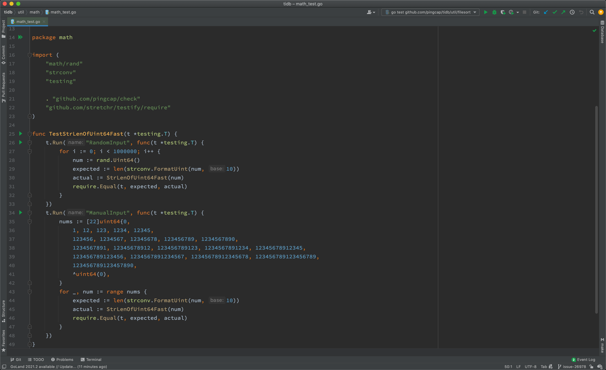

# Write and run unit tests

The TiDB project runs unit tests using [testify](https://github.com/stretchr/testify).

You may find tests using [pingcap/check](http://github.com/pingcap/check) which is a fork of [go-check/check](https://github.com/go-check/check), but since that framework is poorly maintained, we are migrating to testify.

You can check the background and progress on the migration [tracking issue](https://github.com/pingcap/tidb/issues/26022).

## How to write unit tests?

We uses testify for writing unit tests. Basically, it is out-of-the-box [testing](https://pkg.go.dev/testing) with testify assertions.

### TestMain

When running tests, Golang compiles each package along with any files with names with suffix `_test.go`. Thus, a test binary contains tests in a package.

Golang testing provides a mechanism to support doing extra setup or teardown before or after testing by writing a package level unique function:

```go
func TestMain(m *testing.M)
```

We leverage the function to detect Goroutine leak by [goleak](https://github.com/uber-go/goleak) after all tests finished.

Before writing any unit tests in a package, create a file named `main_test.go` and setup the scaffolding:

```go
func TestMain(m *testing.M) {
    goleak.VerifyTestMain(m)
}
```

You can also put global variables or helper functions of the test binary in this file.

### Assertion

Let's write a basic test for utility function `StrLenOfUint64Fast`.

```go
func TestStrLenOfUint64Fast(t *testing.T) {
    for i := 0; i < 1000000; i++ {
        num := rand.Uint64()
        expected := len(strconv.FormatUint(num, 10))
        actual := StrLenOfUint64Fast(num)
        require.Equal(t, expected, actual)
    }
}
```

Golang testing detects test functions from `*_test.go` files of the form:

```go
func TestXxx(*testing.T)
```

where `Xxx` does not start with a lowercase letter. The function name serves to identify the test routine.

We follow this pattern but using testify assertions instead of out-of-the-box methods, like `Error` or `Fail`, since they are too low level to use.

Almost we use `require.Xxx` for assertions, which imported from `github.com/stretchr/testify/require`. It fails immediately if the assertions fails and we tend to fail tests fast.

Below are the most frequently used assertions:

```go
func Equal(t TestingT, expected interface{}, actual interface{}, msgAndArgs ...interface{})
func EqualValues(t TestingT, expected interface{}, actual interface{}, msgAndArgs ...interface{})
func Len(t TestingT, object interface{}, length int, msgAndArgs ...interface{})
func Nil(t TestingT, object interface{}, msgAndArgs ...interface{})
func NoError(t TestingT, err error, msgAndArgs ...interface{})
func NotNil(t TestingT, object interface{}, msgAndArgs ...interface{})
func True(t TestingT, value bool, msgAndArgs ...interface{})
```

You can find other assertions follow the [documentation](https://pkg.go.dev/github.com/stretchr/testify/require).

### Parallel

Golang testing provides a method of `testing.T` to run tests in parallel:

```go
t.Parallel()
```

We leverage this function to run tests as parallel as possible, so that we make full use of the resource accessible.

When some tests should be run in serial, take use of Golang testing [subtests](https://pkg.go.dev/testing#hdr-Subtests_and_Sub_benchmarks) and parallel the parent test only. In this way, tests in the same subtests set run in serial.

```go
func TestParent(t *testing.T) {
    t.Parallel()
    // <setup code>
    t.Run("Serial 0", func(t *testing.T) { ... })
    t.Run("Serial 1", func(t *testing.T) { ... })
    t.Run("Serial 2", func(t *testing.T) { ... })
    // <tear-down code>
}
```

Generally, if a test modifies global configs or failpoints, it should be considered run in serial.

### TestKit

Most of our tests are much more complex than what are described above. For example, to set up a test, we may create a mock storage, a mock session, or even a local database instance.

These functions are known as testkits. Some are used in one package so we implement them in place, others are quite common so we move it to the `testkit` directory.

When you write complex unit tests, you may take a look at what testkits we have now and try to leverage them. If there is none and the case you meet is considered common, add one.

## How to run unit tests?

### Running all tests

You can always run all tests by executing the `gotest` target in Makefile.

```
make gotest
```

which is almost equivalent to `go test ./...` but enable and disable fail points before and after running tests.

[pingcap/failpoint](https://github.com/pingcap/failpoint) is an implementation of [failpoints](https://www.freebsd.org/cgi/man.cgi?query=fail) for Golang. Fail point is used to add code points where errors may be injected in a user controlled fashion. It is a code snippet that is only executed when the corresponding fail point is active.

### Running a single test

To run a single test, you can manually repeat what `make gotest` does and narrow the scope in one test or one package.

```
make failpoint-enable
cd <package-directory>
go test # with any options to locate a test
cd <root>
make failpoint-disable
```

If you develop with GoLand, you can also run a test from the IDE following the [documentation](https://www.jetbrains.com/help/go/performing-tests.html), with manually enable and disable failpoints.



As shown above, you can run tests of the whole package, of a test, or of a subtest, by click the corresponding gutter icon.

### Running tests for pull request

Before merging a pull request, it requires to pass all tests.

Generally continuous integration will run tests for you, but if you want to run tests with conditions or rerun tests on failure, you should know how to achieve that.

#### `/rebuild`

Build the binary based on the PR for testing. It also reruns all the CI test cases.

#### `/run-all-tests`

Rerun all the CI test cases. This command accepts the following parameters:

* `tidb=<branch>|<pr/$num>` specifies which tidb to use
* `tikv=<branch>|<pr/$num>` specifies which tikv to use
* `pd=<branch>|<pr/$num>` specifies which pd to use
* `tidb-test=<branch>|<pr/$num>` specifies which tidb-test to use
* `tidb-private-test=<branch>|<pr/$num>` specifies which tidb-private-test to use

for examples,

```
/run-all-tests tidb-test=pr/666
/run-all-tests tidb-test=release-2.1
/run-all-tests tikv=pr/999
```

#### `/run-{{test}}`

Run a single CI test. This command accepts the same parameters as `/run-all-tests`.

## How to find the failed tests?

There are several common cause of failed tests.

### Assertion failed

The most common cause of failed tests is assertion failed. Its failure report looks like:

```
=== RUN   TestTopology
    info_test.go:72: 
        	Error Trace:	info_test.go:72
        	Error:      	Not equal: 
        	            	expected: 1282967700000
        	            	actual  : 1628585893
        	Test:       	TestTopology
--- FAIL: TestTopology (0.76s)
```

You may `grep "FAIL:"` the output to find this kind of failure.

### Data race

Golang testing supports detecting data race by running tests with `-race` flag. Its failure report looks like:

```
[2021-06-21T15:36:38.766Z] ==================
[2021-06-21T15:36:38.766Z] WARNING: DATA RACE
[2021-06-21T15:36:38.766Z] Read at 0x00c0055ce380 by goroutine 108:
...
[2021-06-21T15:36:38.766Z] Previous write at 0x00c0055ce380 by goroutine 169:
[2021-06-21T15:36:38.766Z]   [failed to restore the stack]
```

### Goroutine leak

We use goleak to detect goroutine leak for tests. Its failure report looks like:

```
goleak: Errors on successful test run: found unexpected goroutines:
[Goroutine 104 in state chan receive, with go.etcd.io/etcd/pkg/logutil.(*MergeLogger).outputLoop on top of the stack:
goroutine 104 [chan receive]:
go.etcd.io/etcd/pkg/logutil.(*MergeLogger).outputLoop(0xc000197398)
	/go/pkg/mod/go.etcd.io/etcd@v0.5.0-alpha.5.0.20200824191128-ae9734ed278b/pkg/logutil/merge_logger.go:173 +0x3ac
created by go.etcd.io/etcd/pkg/logutil.NewMergeLogger
	/go/pkg/mod/go.etcd.io/etcd@v0.5.0-alpha.5.0.20200824191128-ae9734ed278b/pkg/logutil/merge_logger.go:91 +0x85

```

You can determine source of package leaks follow the [documentation](https://github.com/uber-go/goleak/#determine-source-of-package-leaks)

### Timeout

After @tiancaiamao introduced the timeout checker for continuous integration, every test case should run in at most five seconds.

If a test case violates this requirement, its failure report looks like:

```
[2021-08-09T03:33:57.661Z] The following test cases take too long to finish:
[2021-08-09T03:33:57.661Z] PASS: tidb_test.go:874: tidbTestSerialSuite.TestTLS	7.388s
```
