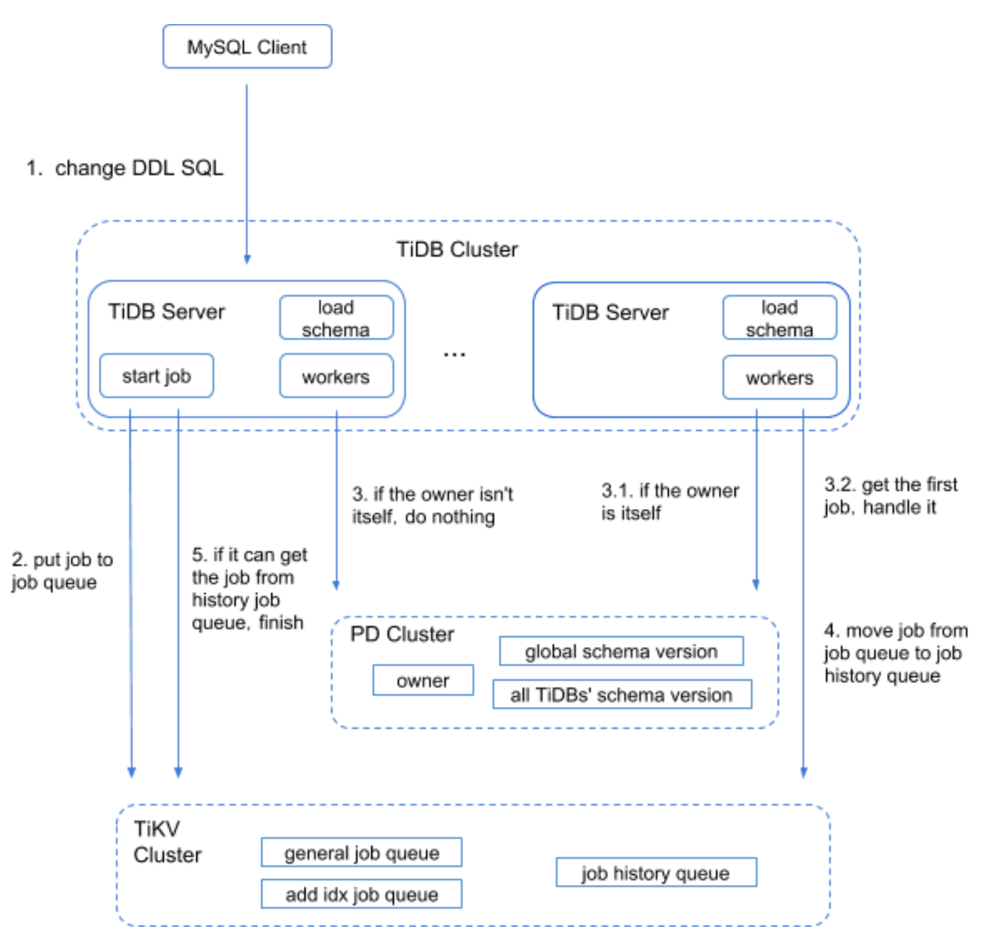
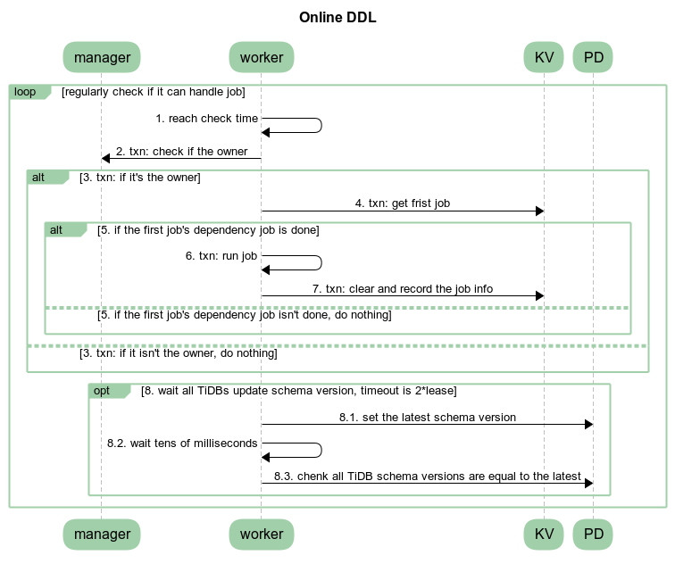

# DDL - Data Definition Language / Schema change handling


## A short introduction to TiDB's DDL

The design behind TiDB's DDL implementation can be read in the [Online DDL design doc](https://github.com/pingcap/tidb/blob/master/docs/design/2018-10-08-online-DDL.md)

TiDB is a distributed database which needs to have a consistent view of all schemas across the whole cluster. To achieve this in a more asyncronous way, the system uses internal states where each single stage transition is done so that the old/previous stage is compatible with the new/current state, allowing different TiDB Nodes having different versions of the schema definition. All TiDB servers in a cluster shares at most two schema versions/states at the same time, so before moving to the next state change, all currently available TiDB servers needs to be syncronised with the current state.

The states used are defined in [parser/model/model.go](https://github.com/pingcap/parser/blob/ac711116bdff3327dd0acd1a86bd65a796076ef2/model/model.go#L33):
```golang
        // StateNone means this schema element is absent and can't be used.
        StateNone SchemaState = iota
        // StateDeleteOnly means we can only delete items for this schema element.
        StateDeleteOnly
        // StateWriteOnly means we can use any write operation on this schema element,
        // but outer can't read the changed data.
        StateWriteOnly
        // StateWriteReorganization means we are re-organizing whole data after write only state.
        StateWriteReorganization
        // StateDeleteReorganization means we are re-organizing whole data after delete only state.
        StateDeleteReorganization
        // StatePublic means this schema element is ok for all write and read operations.
        StatePublic
```

Note: this is a very different implementation from MySQL, which uses Meta Data Locks (MDL) for keeping a single version of the MySQL instance schemas at a time. This results in MySQL replicas can have different version of the schemas, due to lag in asyncronous replication. TiDB has always a consistent view of all schemas in the cluster.

## Implementation

All DDL jobs goes through two cluster wide DDL Queues:
- Generic queue for non data changes, [DefaultJobListKey](https://github.com/pingcap/tidb/blob/476027077e43902f69b6d4b4608ebd06fd831d12/meta/meta.go#L687).
- Add Index Queue for data changes/reorganizations, [AddIndexJobListKey](https://github.com/pingcap/tidb/blob/476027077e43902f69b6d4b4608ebd06fd831d12/meta/meta.go#L689), to not block DDLs that does not require data reorganization/backfilling).

The two base operations for these queue are:
- [enqueue](https://github.com/pingcap/tidb/blob/476027077e43902f69b6d4b4608ebd06fd831d12/meta/meta.go#L701), adding one DDL job to the queue.
- [dequeue](https://github.com/pingcap/tidb/blob/476027077e43902f69b6d4b4608ebd06fd831d12/meta/meta.go#L722), picking one DDL job from the queue.

When a DDL job is completed it will be [moved to the DDL history](https://github.com/pingcap/tidb/blob/476027077e43902f69b6d4b4608ebd06fd831d12/meta/meta.go#L883).

There are two main execution parts handling DDLs:
- TiDB session, which are executing your statements. This will parse and validate the SQL DDL statement and create a [DDL job](https://github.com/pingcap/parser/blob/687005894c4edbc38a1bbf4e02c0c63127dfd209/model/ddl.go#L208) and enqueue it in the corresponding queue. It will then monitor the DDL History until the operation is complete (succeeded or failed) and return the result back to the MySQL client.
- DDL background goroutines:
  - [limitDDLJobs](https://github.com/pingcap/tidb/blob/d53f9f55a0f92589ea18b642b700dbb1b3cfbbfd/ddl/ddl_worker.go#L257) which takes tasks from the sessions and adds to the DDL queues in batches.
  - [workers](https://github.com/pingcap/tidb/blob/d53f9f55a0f92589ea18b642b700dbb1b3cfbbfd/ddl/ddl_worker.go#L154) for processing DDLs:
    - General worker, handling the default DDL Queue where only metadata changes are needed.
    - Add Index worker, which updates/backfills data requested in the AddIndexJob Queue.
  - [DDL Owner manager](https://github.com/pingcap/tidb/blob/d53f9f55a0f92589ea18b642b700dbb1b3cfbbfd/owner/manager.go#L226) managing that one and only one TiDB node in the cluster is the DDL manager.

### Execution in the TiDB session

The execution of the DDL is started through the 'Next' iterator of the DDLExec class (just like normal query execution):

```
 0  0x0000000003cd6cd5 in github.com/pingcap/tidb/executor.(*DDLExec).Next
    at ./executor/ddl.go:90
 1  0x0000000003cf3034 in github.com/pingcap/tidb/executor.Next
    at ./executor/executor.go:286
 2  0x0000000003c1f085 in github.com/pingcap/tidb/executor.(*ExecStmt).handleNoDelayExecutor
    at ./executor/adapter.go:584
 3  0x0000000003c1d890 in github.com/pingcap/tidb/executor.(*ExecStmt).handleNoDelay
    at ./executor/adapter.go:465
 4  0x0000000003c1d11e in github.com/pingcap/tidb/executor.(*ExecStmt).Exec
    at ./executor/adapter.go:414
 5  0x0000000003eedb56 in github.com/pingcap/tidb/session.runStmt
    at ./session/session.go:1682
 6  0x0000000003eec639 in github.com/pingcap/tidb/session.(*session).ExecuteStmt
    at ./session/session.go:1576
 7  0x0000000003fab0af in github.com/pingcap/tidb/server.(*TiDBContext).ExecuteStmt
    at ./server/driver_tidb.go:219
 8  0x0000000003f9c785 in github.com/pingcap/tidb/server.(*clientConn).handleStmt
    at ./server/conn.go:1841
 9  0x0000000003f9a5f2 in github.com/pingcap/tidb/server.(*clientConn).handleQuery
    at ./server/conn.go:1710
10  0x0000000003f94f9c in github.com/pingcap/tidb/server.(*clientConn).dispatch
    at ./server/conn.go:1222
11  0x0000000003f9133f in github.com/pingcap/tidb/server.(*clientConn).Run
    at ./server/conn.go:979
12  0x0000000003fd5798 in github.com/pingcap/tidb/server.(*Server).onConn
    at ./server/server.go:536
13  0x00000000012c4dc1 in runtime.goexit
    at /usr/lib/go-1.16/src/runtime/asm_amd64.s:1371
```

Where the different DDL operations are executed as their own functions, like:
```golang
        switch x := e.stmt.(type) {
        case *ast.AlterDatabaseStmt:
                err = e.executeAlterDatabase(x)
        case *ast.AlterTableStmt:
                err = e.executeAlterTable(ctx, x)
        case *ast.CreateIndexStmt:
                err = e.executeCreateIndex(x)
        case *ast.CreateDatabaseStmt:
                err = e.executeCreateDatabase(x)
        case *ast.CreateTableStmt:
                err = e.executeCreateTable(x)
        case *ast.CreateViewStmt:
                err = e.executeCreateView(x)
        case *ast.DropIndexStmt:
                err = e.executeDropIndex(x)
        case *ast.DropDatabaseStmt:
                err = e.executeDropDatabase(x)
```

Let us use the simple CREATE TABLE as an example (which does not need any of the WriteOnly or DeleteOnly states):
```sql
CREATE TABLE t (id int unsigned NOT NULL PRIMARY KEY, notes varchar(255));
```

This statement has the CreateTableStmt Abstract Syntax Tree type and will be handled by [executeCreateTable](https://github.com/pingcap/tidb/blob/7fd60012336c46158df46c30d095a364fcc103f3/executor/ddl.go#L295)/[CreateTable](https://github.com/pingcap/tidb/blob/7fd60012336c46158df46c30d095a364fcc103f3/ddl/ddl_api.go#L1862) functions.

It will fill in a [TableInfo](https://github.com/pingcap/parser/blob/687005894c4edbc38a1bbf4e02c0c63127dfd209/model/model.go#L269) struct according to the table definition in the statement and create a [DDL job](https://github.com/pingcap/parser/blob/687005894c4edbc38a1bbf4e02c0c63127dfd209/model/ddl.go#L208) and call [doDDLJob](https://github.com/pingcap/tidb/blob/7fd60012336c46158df46c30d095a364fcc103f3/ddl/ddl.go#L541) which goes through the [limitDDLJobs](https://github.com/pingcap/tidb/blob/6eb02fbe5ed448a2c814dd5563414fb733274329/ddl/ddl_worker.go#L257) goroutine and adds one or more jobs to the DDL Job Queue in [addBatchDDLJobs](https://github.com/pingcap/tidb/blob/6eb02fbe5ed448a2c814dd5563414fb733274329/ddl/ddl_worker.go#L279)

DDL Job encoded as JSON:
```json
{
  "id": 56,
  "type": 3,
  "schema_id": 1,
  "table_id": 55,
  "schema_name": "test",
  "state": 0,
  "err": null,
  "err_count": 0,
  "row_count": 0,
  "raw_args": [
    {
      "id": 55,
      "name": {
        "O": "t",
        "L": "t"
      },
      "charset": "utf8mb4",
      "collate": "utf8mb4_bin",
      "cols": [
        {
          "id": 1,
          "name": {
            "O": "id",
            "L": "id"
          },
          "offset": 0,
          "origin_default": null,
          "origin_default_bit": null,
          "default": null,
          "default_bit": null,
          "default_is_expr": false,
          "generated_expr_string": "",
          "generated_stored": false,
          "dependences": null,
          "type": {
            "Tp": 3,
            "Flag": 4131,
            "Flen": 10,
            "Decimal": 0,
            "Charset": "binary",
            "Collate": "binary",
            "Elems": null
          },
          "state": 5,
          "comment": "",
          "hidden": false,
          "change_state_info": null,
          "version": 2
        },
        {
          "id": 2,
          "name": {
            "O": "notes",
            "L": "notes"
          },
          "offset": 1,
          "origin_default": null,
          "origin_default_bit": null,
          "default": null,
          "default_bit": null,
          "default_is_expr": false,
          "generated_expr_string": "",
          "generated_stored": false,
          "dependences": null,
          "type": {
            "Tp": 15,
            "Flag": 0,
            "Flen": 255,
            "Decimal": 0,
            "Charset": "utf8mb4",
            "Collate": "utf8mb4_bin",
            "Elems": null
          },
          "state": 5,
          "comment": "",
          "hidden": false,
          "change_state_info": null,
          "version": 2
        }
      ],
      "index_info": null,
      "constraint_info": null,
      "fk_info": null,
      "state": 0,
      "pk_is_handle": true,
      "is_common_handle": false,
      "common_handle_version": 0,
      "comment": "",
      "auto_inc_id": 0,
      "auto_id_cache": 0,
      "auto_rand_id": 0,
      "max_col_id": 2,
      "max_idx_id": 0,
      "max_cst_id": 0,
      "update_timestamp": 0,
      "ShardRowIDBits": 0,
      "max_shard_row_id_bits": 0,
      "auto_random_bits": 0,
      "pre_split_regions": 0,
      "partition": null,
      "compression": "",
      "view": null,
      "sequence": null,
      "Lock": null,
      "version": 4,
      "tiflash_replica": null,
      "is_columnar": false,
      "temp_table_type": 0,
      "policy_ref_info": null,
      "placement_settings": null
    }
  ],
  "schema_state": 0,
  "snapshot_ver": 0,
  "real_start_ts": 0,
  "start_ts": 428310284267159550,
  "dependency_id": 0,
  "query": "CREATE TABLE t (id int unsigned NOT NULL PRIMARY KEY, notes varchar(255))",
  "binlog": {
    "SchemaVersion": 0,
    "DBInfo": null,
    "TableInfo": null,
    "FinishedTS": 0
  },
  "version": 1,
  "reorg_meta": null,
  "multi_schema_info": null,
  "priority": 0
}
```

### Execution in the TiDB DDL Owner

When the tidb-server starts, it will initialise a [domain](https://github.com/pingcap/tidb/blob/463cc34410d8075f41e5a6151170dbe8a5ae4088/domain/domain.go#L676) where it creates a DDL object and calls [ddl.Start()](https://github.com/pingcap/tidb/blob/7fd60012336c46158df46c30d095a364fcc103f3/ddl/ddl.go#L346) which starts the limitDDLJobs goroutine and the two DDL workers. It also starts the [CampaignOwner](https://github.com/pingcap/tidb/blob/d4580596ee4512861924d5028f2753439b860053/owner/manager.go#L187)/[campaignLoop](https://github.com/pingcap/tidb/blob/d4580596ee4512861924d5028f2753439b860053/owner/manager.go#L226) which monitor the owner election and makes sure to elect a new Owner when needed.

A ddl worker goes through this workflow in a loop (which may handle one job state per loop, leaving other work to a new loop):
- Wait for either a signal from local sessions, global changes through PD/etcd or a ticker (2 * lease time or max 1 second) and then calls [handleDDLJobQueue](https://github.com/pingcap/tidb/blob/476027077e43902f69b6d4b4608ebd06fd831d12/ddl/ddl_worker.go#L484).
- Start a transaction.
- Checks if it is the owner (and if not just returns).
- Picks the first job from its DDL queue.
- Waits for dependent jobs (like reorganisations/backfill needs to wait for its meta-data jobs to be finished first, which it is dependent on).
- Waits for the current/old schema version to be globally syncronised, if needed, by waiting until the lease time is passed or all tidb nodes have updated their schema version. 
- If the job is done (completed or rolled back):
  - Clean up old physical tables or indexes, not part of the new table.
  - Remove the job from the ddl queue.
  - Add the job to the DDL History.
  - Return from handleDDLJobQueue, we are finished!
- Execute the actual DDL job, [runDDLJob](https://github.com/pingcap/tidb/blob/d53f9f55a0f92589ea18b642b700dbb1b3cfbbfd/ddl/ddl_worker.go#L709) See more about this below!
- Update the DDL Job in the queue, for the next loop/transaction.
- Write to the binlog.

The excution of the job's DDL changes in [runDDLJob](https://github.com/pingcap/tidb/blob/d53f9f55a0f92589ea18b642b700dbb1b3cfbbfd/ddl/ddl_worker.go#L709) looks like this:
```golang
        // For every type, `schema/table` modification and `job` modification are conducted
        // in the one kv transaction. The `schema/table` modification can be always discarded
        // by kv reset when meets a unhandled error, but the `job` modification can't.
        // So make sure job state and args change is after all other checks or make sure these
        // change has no effect when retrying it.
        switch job.Type {
        case model.ActionCreateSchema:
                ver, err = onCreateSchema(d, t, job)
        case model.ActionModifySchemaCharsetAndCollate:
                ver, err = onModifySchemaCharsetAndCollate(t, job)
        case model.ActionDropSchema:
                ver, err = onDropSchema(d, t, job)
        case model.ActionCreateTable:
                ver, err = onCreateTable(d, t, job)
        case model.ActionCreateView:
                ver, err = onCreateView(d, t, job)
        case model.ActionDropTable, model.ActionDropView, model.ActionDropSequence:
                ver, err = onDropTableOrView(d, t, job)
        case model.ActionDropTablePartition:
                ver, err = w.onDropTablePartition(d, t, job)
        case model.ActionAddColumn:
                ver, err = onAddColumn(d, t, job)
        case model.ActionAddColumns:
                ver, err = onAddColumns(d, t, job)
        case model.ActionDropColumn:
                ver, err = onDropColumn(t, job)
        case model.ActionDropColumns:
                ver, err = onDropColumns(t, job)
        case model.ActionModifyColumn:
                ver, err = w.onModifyColumn(d, t, job)
        case model.ActionSetDefaultValue:
                ver, err = onSetDefaultValue(t, job)
        case model.ActionAddIndex:
                ver, err = w.onCreateIndex(d, t, job, false)
        case model.ActionDropIndex, model.ActionDropPrimaryKey:
                ver, err = onDropIndex(t, job)
        case model.ActionDropIndexes:
                ver, err = onDropIndexes(t, job)
        case model.ActionTruncateTable:
                ver, err = onTruncateTable(d, t, job)
        ...
```

Where each operation is handled separately, which is also one of the reasons TiDB has the limitation of only one DDL operation at a time (i.e. not possible to add one column and drop another column in the same DDL statement).

Following the example of `CREATE TABLE` we see it will be handled by [onCreateTable](https://github.com/pingcap/tidb/blob/d53f9f55a0f92589ea18b642b700dbb1b3cfbbfd/ddl/table.go#L47), which after some checks, will create a new Schema version and if table is not yet in `StatePublic` state, it will create the table in [CreatetableOrView](https://github.com/pingcap/tidb/blob/d53f9f55a0f92589ea18b642b700dbb1b3cfbbfd/meta/meta.go#L358) which simply writes the TableInfo as a JSON into the meta database.

Notice that it will take another loop in the handleDDLJobQueue above to finish the DDL Job by updating the Schema version and syncronising it with other TiDB nodes.

### Graphs over DDL life cycle

An overview of the DDL execution flow in the TiDB cluster can be seen here:


And more specifically for the DDL worker:


## References

[Online DDL design doc](https://github.com/pingcap/tidb/blob/master/docs/design/2018-10-08-online-DDL.md)
