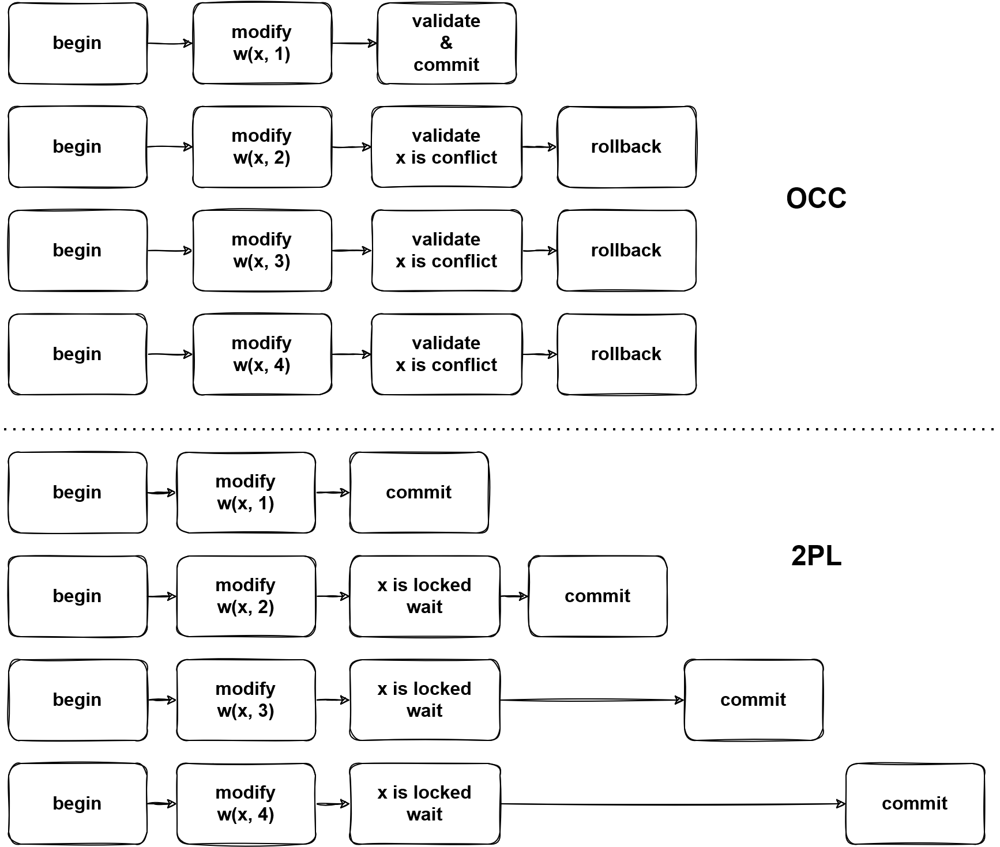

# DML

## Overview

[DML](https://en.wikipedia.org/wiki/Data_manipulation_language) is a sublanguage of SQL which is used as data manipulation. This document talks about the DML processing in TiDB.

This document refers to the code of [TiDB v5.2.1](https://github.com/pingcap/tidb/tree/v5.2.1) and [TiKV v5.2.1](https://github.com/tikv/tikv/tree/v5.2.1).

## Execution Process

The [lifecycle](https://pingcap.github.io/tidb-dev-guide/understand-tidb/the-lifecycle-of-a-statement.html) chapter explains how queries are handled in TiDB. Different from DQLs which may write a lot of content to the client and should be processed in a streaming-like way, DMLs only report the result statistics(count of rows affected and inserted), which are handled by [`handleNoDelay`](https://github.com/pingcap/tidb/blob/v5.2.1/executor/adapter.go#L440-L482) function.

Generally, a DML statement is converted into delta changes in the execution process. When a transaction is committed, the changes will be applied atomically. Without starting a transaction explicitly, it'll be committed automatically. In which, this document focuses on how a DML is executed only.

Compare with DQLs, DMLs are relatively simple in optimization, it's easy to imagine how the delete, insert, update, and replace statements look like and how they should be executed. There may be some data sources in DMLs, like `insert into table1 select from table2` which will insert the data from table2 into table1, however, you may not care about the data sources too much, since the data can be read by just calling `Next` of reading executors.

Like DQLs, the physical plans will be built into executors after optimization in the [`build`](https://github.com/pingcap/tidb/blob/v5.2.1/executor/builder.go#L118-L270) function. The replace statement is treated as a kind of insert statement.

```rust
func (b *executorBuilder) build(p plannercore.Plan) Executor {
	switch v := p.(type) {
	case nil:
		return nil
  ...
	case *plannercore.Delete:
		return b.buildDelete(v)
	...
	case *plannercore.Insert:
		return b.buildInsert(v)
	...
	case *plannercore.Update:
		return b.buildUpdate(v)
	...
	}
}
```

After the execution, the input SQL statements will be converted into delta changes and stored in MemDB, we'll talk about it later.

Like DQLs, DMLs also rely on the schema. When a SQL is compiled, the schema is assigned. Manipulating data should base on the corresponding schema. Tables in the schema offer [`Table`](https://github.com/pingcap/tidb/blob/v5.2.1/table/table.go#L164-L197) interface, which is a medium of data manipulation.

## Conflict

Without conflicts, DMLs are easy, they are converted into delta changes and waiting to be committed during execution. This section will talk about the conflict handle issue.

### Optimistic

TiDB can check the conflict for optimistic transactions whether during execution and commit. The behavior is controlled by [`tidb_constraint_check_in_place`](https://docs.pingcap.com/tidb/stable/system-variables#tidb_constraint_check_in_place). By default, TiDB won't check if there is a conflict when executing optimistic transactions. A conflict means that there is a record whose `commit_ts` is less than the current transaction's `start_ts`, by checking this situation TiDB needs to look up TiKV and see if such a record exists, there the latency is introduced. The code for handling the [row key](https://github.com/pingcap/tidb/blob/v5.2.1/table/tables/tables.go#L781-L792) and [unique index key](https://github.com/pingcap/tidb/blob/v5.2.1/table/tables/index.go#L205-L209) is below.

```go
// AddRecord implements table.Table AddRecord interface.
func (t *TableCommon) AddRecord(sctx sessionctx.Context, r []types.Datum, opts ...table.AddRecordOption) (recordID kv.Handle, err error) {
...
		} else if sctx.GetSessionVars().LazyCheckKeyNotExists() {
			var v []byte
			v, err = txn.GetMemBuffer().Get(ctx, key)
			if err != nil {
				setPresume = true
			}
			if err == nil && len(v) == 0 {
				err = kv.ErrNotExist
			}
		} else {
			_, err = txn.Get(ctx, key)
		}
...
}

// Create creates a new entry in the kvIndex data.
// If the index is unique and there is an existing entry with the same key,
// Create will return the existing entry's handle as the first return value, ErrKeyExists as the second return value.
func (c *index) Create(sctx sessionctx.Context, txn kv.Transaction, indexedValues []types.Datum, h kv.Handle, handleRestoreData []types.Datum, opts ...table.CreateIdxOptFunc) (kv.Handle, error) {
...
	} else if sctx.GetSessionVars().LazyCheckKeyNotExists() {
		value, err = txn.GetMemBuffer().Get(ctx, key)
	} else {
		value, err = txn.Get(ctx, key)
	}
...
}
```

Skipping checking the existence of records reduces latency, and if there is such a record, the optimistic transactions will suffer an error when committing. In the prewrite phase, if there is a record whose `commit_ts` is less than self's `start_ts`, an [already-exist error](https://github.com/tikv/tikv/blob/v5.2.1/src/storage/txn/actions/prewrite.rs#L359) will be returned and the current transaction should abort, so there are no correctness issues.

As for the use case which requires checking if the key exists in execution, just turn `tidb_constraint_check_in_place` on.

### Pessimistic

Since optimistic transactions check if can submit in prewrite phases, in a high contention use case, there may be cascade abort, and the fail rate of the transaction will increase rapidly. Further, aborted transactions need to be cleaned up, as a result, many resources are wasted.

As the image shows, pessimistic transactions go through a 2PL way.



By any write operations, the corresponding pessimistic locks will be written into TiKV, then other transactions which tend to modify the locked data, a key is locked error will be returned from TiKV, then TiDB will block the statement until the lock is cleared or expired.

The pessimistic transaction lock key is in two steps, e.g. `UPDATE t SET v = v + 1 WHERE id < 10`:

- Read the required data from TiKV, it's like `SELECT row_id FROM t WHERE id < 10` got (1, 1), (2, 4).
- Now TiDB knows which key exists, then based on the read data, lock keys.

However, there is a specific way to add a pessimistic, aka. read and lock. It's an atomic operation, read keys from TiKV and the result is returned with keys locked. Luckily, this way is not widely used, only in [point_get](https://github.com/pingcap/tidb/blob/v5.2.1/executor/point_get.go) and [batch_point_get](https://github.com/pingcap/tidb/blob/v5.2.1/executor/batch_point_get.go). This operation will lock the not-exist keys, which allows the client to lock keys first and write some values later.

There is a special read which is various from snapshot read, which read the data from the latest snapshot. We can call it current read or for-update read. In [snapshot isolation](https://en.wikipedia.org/wiki/Snapshot_isolation), all statements in a transaction are executed in the same snapshot, so there are no non-repeatable or non-phantom reads. However, write operations in pessimistic transactions should affect the latest version of data, which means that they use the different snapshot from the read snapshot.

## MemDB

The delta changes are stored in [`MemDB`](https://github.com/tikv/client-go/blob/daddf73a0706d78c9e980c91c97cc9ed100f1919/internal/unionstore/memdb.go#L64-L88) in TiDB until the transaction is committed. `MemDB` is an ordered in-memory storage(implemented in the red-black tree) with the following requirements.

- Revert changes.
- Flag support.

Think about an in-transaction statement get failed because of conflict or constraint violation, then an error is reported to the client, this statement should take no effect. However, there may already be some changes are written to the `MemDB` before encountering the error. These changes need to be reverted. In TiDB, [`StmtCommit`](https://github.com/pingcap/tidb/blob/v5.2.1/session/txn.go#L535-L548) handles the statement level commit which will flush the changes of successful statements from the staging buffer into `MemDB`. Here are the key methods of the [`MemBuffer`](https://github.com/pingcap/tidb/blob/v5.2.1/kv/kv.go#L118-L126) interface.

```go
// MemBuffer is an in-memory kv collection, can be used to buffer write operations.
type MemBuffer interface {
	...
	// Staging create a new staging buffer inside the MemBuffer.
	// Subsequent writes will be temporarily stored in this new staging buffer.
	// When you think all modifications looks good, you can call `Release` to public all of them to the upper level buffer.
	Staging() StagingHandle
	// Release publish all modifications in the latest staging buffer to upper level.
	Release(StagingHandle)
	// Cleanup cleanup the resources referenced by the StagingHandle.
	// If the changes are not published by `Release`, they will be discarded.
	Cleanup(StagingHandle)
	...
}
```

The [`KeyFlags`](https://github.com/tikv/client-go/blob/daddf73a0706d78c9e980c91c97cc9ed100f1919/kv/keyflags.go#L35-L48) are the metadata of keys, they mark the keys with states. You can learn the meaning from their names, e.g. if `flagPresumeKNE` is set, the key is presumed as not existing in TiKV, which means this is an inserted key, otherwise, it's an updated key.

## Summary

This document talks about DML generally. However, TiDB is a complex system, and DML has correlation with most components, you may be confused about many details with manipulation of data, reading other documents or the source code would make it clear.
