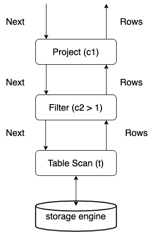
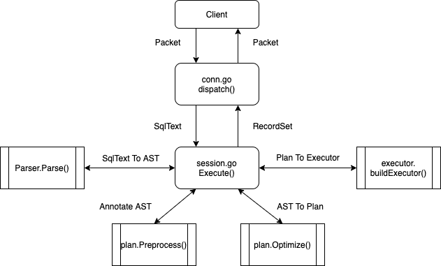

# DQL

## Overview

This chapter describes the execution process of a data query statement in TiDB. Starting from the SQL processing flow, it describes how a SQL statement is sent to TiDB, how TiDB processes it after receiving the SQL statement and how the execution result is returned.

## Execution Process

Briefly, the execution process of a SQL statement can be divided into three stages:

1. Protocol Layer

   Protocol layer is responsible for parsing the network protocol. Its codes locate at `server` package, mainly consisting of two parts: one for connection establishing and management, every connection corresponds to one session; one for handling the packets read from the connection.

2. SQL Layer

   SQL layer is the most complex part in TiDB, handling SQL statement parsing and execution. SQL is a complex language, hasing various data types and operators, numerous syntax combinations, so a large portion of TiDB codes are spent on SQL layer. Besides, TiDB uses a distributed storage engine underneath, so it will encounter many problems stand-alone storage engines won't.

3. KV API Layer

   KV API layer routes requests to the right KV server and passes the results back to SQL layer. It should handle the exceptions happened in this stage.

A SQL statement goes through the above three stages sequentially, get parsed and transformed, then handled by SQL layer. In SQL layer, query plans are generated and executed, retrieving data from the underneath storage engine. We'll give a detailed introduction to SQL layer.

### Protocol Layer

#### Entry

The entry of TiDB's SQL layer is in `server/conn.go`. After a connection is established between the client and TiDB, TiDB spawns a goroutine to listen and poll on the port. In [clientConn.Run()](https://github.com/pingcap/tidb/blob/05d2210647d6a1503a8d772477e43b14a024f609/server/conn.go#L911), a loop keeps reading network packets and calls [clientConn.dispatch()](https://github.com/pingcap/tidb/blob/05d2210647d6a1503a8d772477e43b14a024f609/server/conn.go#L1111) to handle them:

```go
data, err := cc.readPacket()
if err = cc.dispatch(ctx, data)
```

`dispatch` handles the raw data array. The first byte of the array represents command type. Among the types, `COM_QUERY` represents data query statement. You can refer to [MySQL protocol](https://dev.mysql.com/doc/internals/en/client-server-protocol.html) for more information about the data array. For `COM_QUERY`, its content is SQL statement. [clientConn.handleQuery()](https://github.com/pingcap/tidb/blob/05d2210647d6a1503a8d772477e43b14a024f609/server/conn.go#L1633) handles the SQL statement. It calls [TiDBContext.ExecuteStmt()](https://github.com/pingcap/tidb/blob/05d2210647d6a1503a8d772477e43b14a024f609/server/driver_tidb.go#L217) in `server/driver_tidb.go`:

```go
func (tc *TiDBContext) ExecuteStmt(ctx context.Context, stmt ast.StmtNode) (ResultSet, error) {
	rs, err := tc.Session.ExecuteStmt(ctx, stmt)
```

[session.ExecuteStmt()](https://github.com/pingcap/tidb/blob/05d2210647d6a1503a8d772477e43b14a024f609/session/session.go#L1620) is in `session.go`. It's the entry of the SQL layer kernel and returns the result of the SQL execution.

#### Exit

After a series of operations described above, the execution results will be returned to the client in [COM_QUERY response](https://dev.mysql.com/doc/internals/en/com-query-response.html) format by [clientConn.writeResultSet()](https://github.com/pingcap/tidb/blob/05d2210647d6a1503a8d772477e43b14a024f609/server/conn.go#L1943).

### SQL Layer

In SQL layer, there are multiple concepts and interfaces we need to pay close attention to:

* [Session](https://github.com/pingcap/tidb/blob/05d2210647d6a1503a8d772477e43b14a024f609/session/session.go#L123)
* [RecordSet](https://github.com/pingcap/tidb/blob/05d2210647d6a1503a8d772477e43b14a024f609/util/sqlexec/restricted_sql_executor.go#L133)
* [Plan](https://github.com/pingcap/tidb/blob/05d2210647d6a1503a8d772477e43b14a024f609/planner/core/plan.go#L36)
* [Executor](https://github.com/pingcap/tidb/blob/05d2210647d6a1503a8d772477e43b14a024f609/executor/executor.go#L258)

#### Session

The most important function in `Session` is `ExecuteStmt`. It wraps calls to other modules. The SQL execution will respect environment variables in `Session` like `AutoCommit` and timezone.

#### Parser

[Parser](https://github.com/pingcap/parser/blob/10b704ade769e4eb0681b74c0c223c4291073308/yy_parser.go) consists of [Lexer](https://github.com/pingcap/parser/blob/10b704ade769e4eb0681b74c0c223c4291073308/lexer.go) and Yacc. It turns the SQL text to AST:

```go
p := parserPool.Get().(*parser.Parser)
defer parserPool.Put(p)
p.SetSQLMode(s.sessionVars.SQLMode)
p.SetParserConfig(s.sessionVars.BuildParserConfig())
tmp, warn, err := p.Parse(sql, charset, collation)
```

In the parsing process, lexer first transforms the SQL text to tokens, and then parser accepts the tokens as inputs and generates appropriate AST nodes. For example, statement `SELECT * FROM t WHERE c > 1;` matches [SelectStmt rule](https://github.com/pingcap/tidb/blob/45457ea8810ca7b835da4ba7f55d0eee02043ac5/parser/parser.y#L3936) finally turns to the structure below:

```go
type SelectStmt struct {
	dmlNode
	// SelectStmtOpts wraps around select hints and switches.
	*SelectStmtOpts
	// Distinct represents whether the select has distinct option.
	Distinct bool
	// From is the from clause of the query.
	From *TableRefsClause
	// Where is the where clause in select statement.
	Where ExprNode
	// Fields is the select expression list.
	Fields *FieldList
	// GroupBy is the group by expression list.
	GroupBy *GroupByClause
	// Having is the having condition.
	Having *HavingClause
	// WindowSpecs is the window specification list.
	WindowSpecs []WindowSpec
	// OrderBy is the ordering expression list.
	OrderBy *OrderByClause
	// Limit is the limit clause.
	Limit *Limit
	// LockInfo is the lock type
	LockInfo *SelectLockInfo
	// TableHints represents the table level Optimizer Hint for join type
	TableHints []*TableOptimizerHint
	// IsInBraces indicates whether it's a stmt in brace.
	IsInBraces bool
	// WithBeforeBraces indicates whether stmt's with clause is before the brace.
	// It's used to distinguish (with xxx select xxx) and with xxx (select xxx)
	WithBeforeBraces bool
	// QueryBlockOffset indicates the order of this SelectStmt if counted from left to right in the sql text.
	QueryBlockOffset int
	// SelectIntoOpt is the select-into option.
	SelectIntoOpt *SelectIntoOption
	// AfterSetOperator indicates the SelectStmt after which type of set operator
	AfterSetOperator *SetOprType
	// Kind refer to three kind of statement: SelectStmt, TableStmt and ValuesStmt
	Kind SelectStmtKind
	// Lists is filled only when Kind == SelectStmtKindValues
	Lists []*RowExpr
	With  *WithClause
}
```

`From t` is parsed to `From` field. `WHERE c > 1` is parsed to `Where` field. `*` is parsed to `Fields` field. Most data structures in `ast` package implement `ast.Node` interface. This interface has a `Accept` method, implementing the classic visitor pattern, used by following procedures to traverse the tree.

#### Compile

After the AST is generated, it's going to be validated, transformed and optimized in [Compiler.Compile()](https://github.com/pingcap/tidb/blob/05d2210647d6a1503a8d772477e43b14a024f609/executor/compiler.go#L50):

```go
compiler := executor.Compiler{Ctx: s}
stmt, err := compiler.Compile(ctx, stmtNode)
```

There are three steps:

1. `plan.Preprocess`: do some validatation and name binding.
2. `plan.Optimize`: make and optimize query plans, this is the core part.
3. construct `executor.ExecStmt` structure: [ExecStmt](https://github.com/pingcap/tidb/blob/05d2210647d6a1503a8d772477e43b14a024f609/executor/adapter.go#L186) holds the query plans. It's the foundation for following execution.

#### Executor

While constructing the executor in [ExecStmt.buildExecutor()](https://github.com/pingcap/tidb/blob/05d2210647d6a1503a8d772477e43b14a024f609/executor/adapter.go#L764), query plans are turned to executor. Then the execution engine could perform the query plans via the executor. The generated executor is encapsulated in a `recordSet` structure:

```go
return &recordSet{
	executor:   e,
	stmt:       a,
	txnStartTS: txnStartTS,
}
```

This structure implements [ast.RecordSet](https://github.com/pingcap/tidb/blob/05d2210647d6a1503a8d772477e43b14a024f609/util/sqlexec/restricted_sql_executor.go#L133) interface. It abstracts the query results and has the following methods:

```go
type RecordSet interface {
	// Fields gets result fields.
	Fields() []*ast.ResultField
	// Next reads records into chunk.
	Next(ctx context.Context, req *chunk.Chunk) error
	// NewChunk create a chunk.
	NewChunk() *chunk.Chunk
	// Close closes the underlying iterator, call Next after Close will
	// restart the iteration.
	Close() error
}
```

The functionality of each method is described in the comments. In short, `Fields()` retrieves the type of each column. `Next()` returns a batch of the result. `Close()` closes the result set.

TiDB's execution engine executes in Volcano model. All the executors constitute an executor tree. Every upper layer gathers results from the lower layer by calling its `Next()` method. Assuming we have a SQL statement `SELECT c1 FROM t WHERE c2 > 1;` and the query plan is full table scanning plus filtering, the executor tree is like:



From the above picture, we can see the data flow between executors. The starting point of a SQL statement execution, also the first `Next()` call is in [the function returning data back to the client](https://github.com/pingcap/tidb/blob/05d2210647d6a1503a8d772477e43b14a024f609/server/conn.go#L2016):

```go
err := rs.Next(ctx, req)
```

`rs` is a `RecordSet` instance. Keep calling its `Next` method to get more results to return to the client.

## Overall Diagram

The above SQL query statement execution process can in general be described as the following picture:


