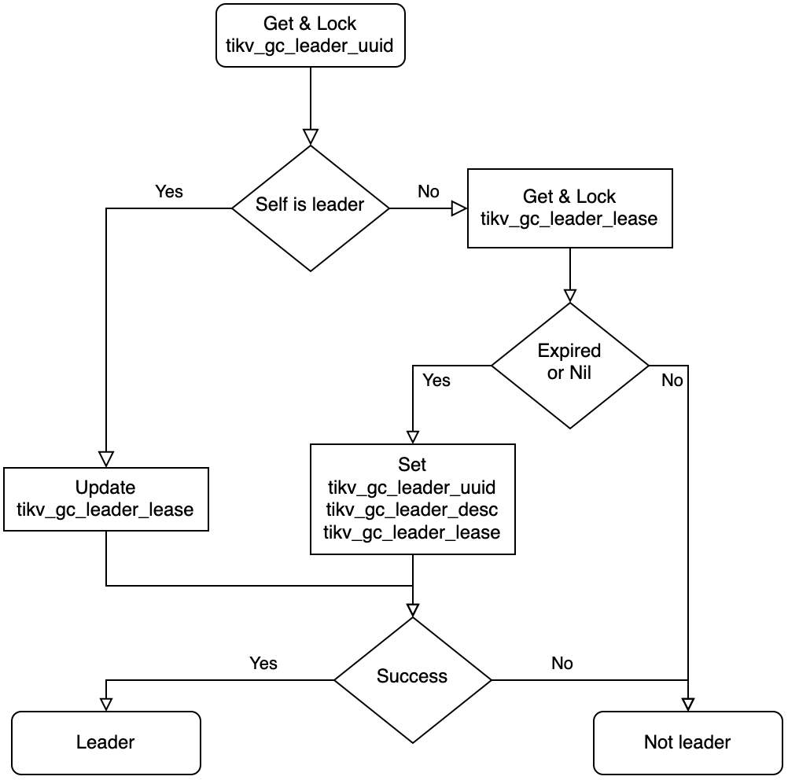

# MVCC Garbage Collection

TiDB is a database built on TiKV, a multi-version storage engine which supports [Snapshot Isolation](https://en.wikipedia.org/wiki/Snapshot_isolation)(SI) based on the [MultiVersion Concurrency Control](https://en.wikipedia.org/wiki/Multiversion_concurrency_control) (MVCC). Semantically, a multi-version system keeps multi copies of data. However, in the long-term running, there will be many garbage data that takes up a lot of disk space as well as has an impact on performance. A GC is responsible for cleaning up unused data and free the space while making less impact on the system as possible. This document talks about how MVCC GC works and implements in TiDB.

This document refers to the code of [TiDB v5.2.1](https://github.com/pingcap/tidb/tree/v5.2.1), [PD v5.2.1](https://github.com/tikv/pd/tree/v5.2.1), and [TiKV v5.2.1](https://github.com/tikv/tikv/tree/v5.2.1).

## TiDB part

You probably already know that data is stored in TiKV instances in a TiDB cluster. However, the GC process should be triggered by TiDB because it's the coordinator of the cluster. There are several requirements for TiDB when triggering GC.

* Clean up as more garbage data as possible.
* Any data that is possibly read by opened transactions should be kept.
* GC should not be frequently triggered.

There is an inner table named `mysql.tidb` in TiDB which stores many runtime information. Actually, these variables are stored in TiKV as common KV variables. We'll talk about the usage of these variables in the GC workflow later.

```
MySQL [test]> select * from mysql.tidb where variable_name like "tikv_gc_%";
+--------------------------+----------------------------------------------------------------------------------------+---------------------------------------------------------------------------------------------+
| VARIABLE_NAME            | VARIABLE_VALUE                                                                         | COMMENT                                                                                     |
+--------------------------+----------------------------------------------------------------------------------------+---------------------------------------------------------------------------------------------+
| tikv_gc_leader_uuid      | 5f0c276e9bc0002                                                                        | Current GC worker leader UUID. (DO NOT EDIT)                                                |
| tikv_gc_leader_desc      | host:xxxxx, pid:95695, start at 2021-09-29 16:13:35.740303321 +0800 CST m=+5.325166809 | Host name and pid of current GC leader. (DO NOT EDIT)                                       |
| tikv_gc_leader_lease     | 20210929-17:09:35 +0800                                                                | Current GC worker leader lease. (DO NOT EDIT)                                               |
| tikv_gc_enable           | true                                                                                   | Current GC enable status                                                                    |
| tikv_gc_run_interval     | 10m0s                                                                                  | GC run interval, at least 10m, in Go format.                                                |
| tikv_gc_life_time        | 10m0s                                                                                  | All versions within life time will not be collected by GC, at least 10m, in Go format.      |
| tikv_gc_last_run_time    | 20210929-17:03:35 +0800                                                                | The time when last GC starts. (DO NOT EDIT)                                                 |
| tikv_gc_safe_point       | 20210929-16:53:35 +0800                                                                | All versions after safe point can be accessed. (DO NOT EDIT)                                |
| tikv_gc_auto_concurrency | true                                                                                   | Let TiDB pick the concurrency automatically. If set false, tikv_gc_concurrency will be used |
| tikv_gc_scan_lock_mode   | legacy                                                                                 | Mode of scanning locks, "physical" or "legacy"                                              |
| tikv_gc_mode             | distributed                                                                            | Mode of GC, "central" or "distributed"                                                      |
+--------------------------+----------------------------------------------------------------------------------------+---------------------------------------------------------------------------------------------+
11 rows in set (0.003 sec)
```

### GC Worker

`GCWorker` is the component responsible for triggering GC in TiDB.

```go
// GCWorker periodically triggers GC process on tikv server.
type GCWorker struct {
	uuid         string
	desc         string
	...
}
```

In `GCWorker` structure, `uuid` field is the unique identifier. When it's initialized, a timestamp is fetched from PD and formatted as a 16bit string, and used as the `uuid`. `desc` is a human-readable identifier that is composed of [some instance information](https://github.com/pingcap/tidb/blob/v5.2.1/store/gcworker/gc_worker.go#L93).

The Start function of GCWorker will be called when TiDB is bootstrapped. In [this file](https://github.com/pingcap/tidb/blob/v5.2.1/store/gcworker/gc_worker.go#L105-L113), a goroutine will be created for triggering GC jobs periodically.

```go
// Start starts the worker.
func (w *GCWorker) Start() {
	var ctx context.Context
	ctx, w.cancel = context.WithCancel(context.Background())
	var wg sync.WaitGroup
	wg.Add(1)
	go w.start(ctx, &wg)
	wg.Wait() // Wait create session finish in worker, some test code depend on this to avoid race.
}
```

There is a [ticker](https://github.com/pingcap/tidb/blob/v5.2.1/store/gcworker/gc_worker.go#L214-L229) in `GCWorker` that will try running the GC task every minute. We'll talk about how it works in the following sections.

### GC Leader

In TiDB's design, there is only one GC leader which can trigger GC in the cluster, so there is an election and lease for the proposal of the leader. `GCWorker` check if it's the leader before starting a real GC job.

```go
func (w *GCWorker) tick(ctx context.Context) {
	isLeader, err := w.checkLeader()
	...
	if isLeader {
		err = w.leaderTick(ctx)
		...
	} else {
		// Config metrics should always be updated by leader, set them to 0 when current instance is not leader.
		metrics.GCConfigGauge.WithLabelValues(gcRunIntervalKey).Set(0)
		metrics.GCConfigGauge.WithLabelValues(gcLifeTimeKey).Set(0)
	}
}
```

Luckily, TiDB is built on a durable and high-available storage layer, which makes the election quite easy by the following mechanism.



This is the flowchart of leader election which is implemented in [`checkLeader`](https://github.com/pingcap/tidb/blob/v5.2.1/store/gcworker/gc_worker.go#L1669) function, if the result is leader, we then trying to tick a GC.

### GC Prepare

When a GC workflow is triggered, we are facing another issue, find out the data that can be cleaned up. Since TiDB follows SI isolation level, all reads performed in a transaction should get the result from the same timestamp, if not so, there will be consistency and repeatable read issues. Besides, we do not hope that the garbage data is cleanup once after it's not used, in some misoperations, recovery is important. That means before starting a GC round, there are [many checks](https://github.com/pingcap/tidb/blob/v5.2.1/store/gcworker/gc_worker.go#L362-L393).

```go
func (w *GCWorker) checkPrepare(ctx context.Context) (bool, uint64, error) {
	enable, err := w.checkGCEnable()
	...
	now, err := w.getOracleTime()
	...
	ok, err := w.checkGCInterval(now)
	...
	newSafePoint, newSafePointValue, err := w.calcNewSafePoint(ctx, now)
	...
	err = w.saveTime(gcLastRunTimeKey, now)
	...
	err = w.saveTime(gcSafePointKey, *newSafePoint)
	...
	return true, newSafePointValue, nil
}
```

Check GC is enabled first, GC is enabled by default, but it's allowed to be turned off.

In TiDB, there is a variable named `tikv_gc_run_interval` which controls the frequency of GC. It's the min interval between 2 GC rounds, which guarantees that data should live more than the interval time, 10min by default.

Once it's ready to perform a GC round, `calcNewSafePoint` is called to get a new safepoint, this deals with some long-term opened transactions. We'll talk about how safepoint is decided later.

If a new safepoint is got, we then update the GC checkpoint and new safepoint, here we're ready to start a GC round. It's ok that TiDB collapse after the new GC round is set because it won't broke the GC promises, we just skip a round of GC.

### GC Safepoint

This is the key problem of GC. What we desired is the min transaction start timestamp between all TiDB instances. TiDB instances will store their min start ts in PD's etcd, so we just fetch all the min transaction start timestamps [here](https://github.com/pingcap/tidb/blob/v5.2.1/store/gcworker/gc_worker.go#L395-L413). `GetWithPrefix` will get all KV pairs from the etcd storage.

```go
func (w *GCWorker) calcGlobalMinStartTS(ctx context.Context) (uint64, error) {
	kvs, err := w.tikvStore.GetSafePointKV().GetWithPrefix(infosync.ServerMinStartTSPath)
	if err != nil {
		return 0, err
	}

	var globalMinStartTS uint64 = math.MaxUint64
	for _, v := range kvs {
		minStartTS, err := strconv.ParseUint(string(v.Value), 10, 64)
		if err != nil {
			logutil.Logger(ctx).Warn("parse minStartTS failed", zap.Error(err))
			continue
		}
		if minStartTS < globalMinStartTS {
			globalMinStartTS = minStartTS
		}
	}
	return globalMinStartTS, nil
}
```

TiDB server has the risk of crash, however, if a never-pushed-up min start ts is left in the system, GC will never works. To solve this issue, the min start ts is set with a lease and if TiDB is offline for a long duration, that min start ts will be cleared.

After we get all the min start timestamps from etcd, it's easy to calculate the global min start timestamp. It's easy to know the min start timestamp from a single TiDB instance, and every TiDB instance will report it's min start timestamp to etcd in [`ReportMinStartTS`](https://github.com/pingcap/tidb/blob/v5.2.1/domain/infosync/info.go#L548-L570) function every interval.

### GC Workflow

Once the safepoint is decided and prepare stage is done, it's ready to start a GC workflow. Generally, there are 3 steps to do.

- Resolve locks.
- Delete unused ranges.
- GC for every key.

The workflow can be found from [GC job function](https://github.com/pingcap/tidb/blob/v5.2.1/store/gcworker/gc_worker.go#L614-L682). The main intent of this workflow is to clean up data has more impact on the running tasks earlier.

In resolve lock phase, GC will clean up the locks of aborted transaction and commit the locks of success transaction. `GCworker` scans the locks from every store and call [`BatchResolveLocks`](https://github.com/tikv/client-go/blob/daddf73a0706d78c9e980c91c97cc9ed100f1919/txnkv/txnlock/lock_resolver.go#L184) for cleaning up, you may read [lock resolver chapter](./lock-resolver.html) for more information of lock.

From TiDB 5.0, it's possible to scan by physical mode which bypass the Raft layer and scan the locks directly. The [`resolveLocks`](https://github.com/pingcap/tidb/blob/v5.2.1/store/gcworker/gc_worker.go#L1001-L1018) function will use legecy mode as a fallback even if physical mode is set.

```go
func (w *GCWorker) resolveLocks(ctx context.Context, safePoint uint64, concurrency int, usePhysical bool) (bool, error) {
	if !usePhysical {
		return false, w.legacyResolveLocks(ctx, safePoint, concurrency)
	}
	// First try resolve locks with physical scan
	err := w.resolveLocksPhysical(ctx, safePoint)
	if err == nil {
		return true, nil
	}
	...
	return false, w.legacyResolveLocks(ctx, safePoint, concurrency)
}
```

The `GCworker` then clean up the unused ranges, they are caused by drop table or drop index statements, when executing the drop statements in TiDB, TiDB only marks some ranges to be deleted and returns success, they are actually cleaned up in GC.

```
MySQL [test]> create table t(id int primary key, v int, key k(v));
Query OK, 0 rows affected (0.109 sec)

MySQL [test]> insert into t values(1,1),(2,2),(3,3);
Query OK, 3 rows affected (0.004 sec)
Records: 3  Duplicates: 0  Warnings: 0

MySQL [test]> alter table t drop index k;
Query OK, 0 rows affected (0.274 sec)

MySQL [test]> SELECT HIGH_PRIORITY job_id, element_id, start_key, end_key FROM mysql.gc_delete_range;
+--------+------------+----------------------------------------+----------------------------------------+
| job_id | element_id | start_key                              | end_key                                |
+--------+------------+----------------------------------------+----------------------------------------+
|     58 |          1 | 7480000000000000385f698000000000000001 | 7480000000000000385f698000000000000002 |
+--------+------------+----------------------------------------+----------------------------------------+
1 row in set (0.002 sec)

MySQL [test]> SELECT HIGH_PRIORITY job_id, element_id, start_key, end_key FROM mysql.gc_delete_range_done WHERE 1;
+--------+------------+--------------------+--------------------+
| job_id | element_id | start_key          | end_key            |
+--------+------------+--------------------+--------------------+
|     55 |         53 | 748000000000000035 | 748000000000000036 |
+--------+------------+--------------------+--------------------+
1 row in set (0.002 sec)
```

The to-be-deleted ranges are stored in `mysql.gc_delete_range`, in GC, they will be deleted in `deleteRanges`. After they are cleaned up, they will be moved into `mysql.gc_delete_range_done`, and double-checked after 24 hours.

Finally, the `GCWorker` is going to clean up the stale keys. There are `central` mode and `distributed` mode. From TiDB 3.0, `tikv_gc_mode` is set to `distributed` mode by default, this document will talk about `distributed` mode only.

Distributed GC is implemented by push up the safepoint in PD. Notice that the safepoint is monotonic, PD guarantees it by comparing the old and new values [here](https://github.com/tikv/pd/blob/v5.2.1/server/grpc_service.go#L1081-L1127).

```go
// UpdateGCSafePoint implements gRPC PDServer.
func (s *Server) UpdateGCSafePoint(ctx context.Context, request *pdpb.UpdateGCSafePointRequest) (*pdpb.UpdateGCSafePointResponse, error) {
	...
	newSafePoint := request.SafePoint

	// Only save the safe point if it's greater than the previous one
	if newSafePoint > oldSafePoint {
		if err := s.storage.SaveGCSafePoint(newSafePoint); err != nil {
			return nil, err
		}
		log.Info("updated gc safe point",
			zap.Uint64("safe-point", newSafePoint))
	} else if newSafePoint < oldSafePoint {
		log.Warn("trying to update gc safe point",
			zap.Uint64("old-safe-point", oldSafePoint),
			zap.Uint64("new-safe-point", newSafePoint))
		newSafePoint = oldSafePoint
	}

	return &pdpb.UpdateGCSafePointResponse{
		Header:       s.header(),
		NewSafePoint: newSafePoint,
	}, nil
}
```

If PD returns the same new safepoint as TiDB provides, TiDB takes this GC round success.

## TiKV Part

This is a document about TiDB dev guide, so there will simply introduce how TiKV works with TiDB with less implementations.

### Distributed GC

As we talked above, TiDB only push up the safepoint in PD instead of cleaning up keys directly. Every TiKV has an inner [`GcManager`](https://github.com/tikv/tikv/blob/v5.2.1/src/server/gc_worker/gc_manager.rs#L217-L237) with `safe_point` field.

```rust
pub(super) struct GcManager<S: GcSafePointProvider, R: RegionInfoProvider, E: KvEngine> {
    cfg: AutoGcConfig<S, R>,

    /// The current safe point. `GcManager` will try to update it periodically. When `safe_point` is
    /// updated, `GCManager` will start to do GC on all regions.
    safe_point: Arc<AtomicU64>,

    safe_point_last_check_time: Instant,

    /// Used to schedule `GcTask`s.
    worker_scheduler: Scheduler<GcTask<E>>,

    /// Holds the running status. It will tell us if `GcManager` should stop working and exit.
    gc_manager_ctx: GcManagerContext,

    cfg_tracker: GcWorkerConfigManager,
    feature_gate: FeatureGate,
}
```

By default, TiKV tries to [pull safepoint](https://github.com/tikv/tikv/blob/v5.2.1/src/server/gc_worker/gc_manager.rs#L301-L322) from PD every 10 seconds. If the pulled safepoint is greater than the local one, the local one will be pushed up, meanwhile, a GC job is trigger in TiKV locally.

## Summary

This document talked about how MVCC GC worked in TiDB system. The most basic requirement of GC is not to delete readable data. Due to the guarantee of GC, you don't need to care about that data is removed. The green GC, skips fetch snapshot when read locks, help to improve the performance of GC. There are some further performance-related topics of GC in TiKV which will be talked in TiKV Dev Guide.
