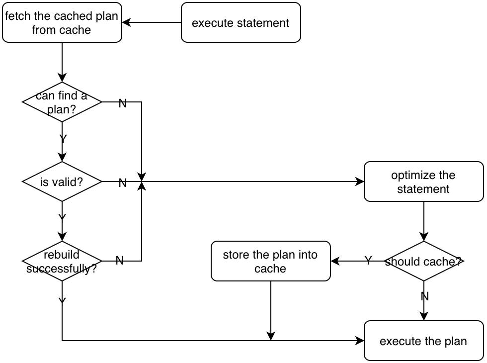
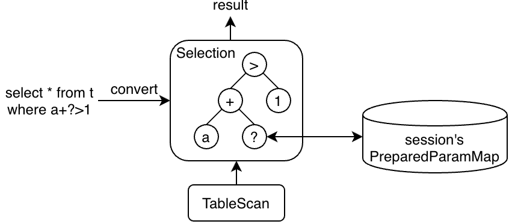

# Plan Cache

## Introduction

TiDB supports `PlanCache` for `prepare` and `execute` statements. By using `PlanCache`, TiDB can skip the optimization phase to gain some performance benefits.

There are several limitations to current `PlanCache`:
1. Only support `prepare` and `execute` statements, not support general queries;
2. Only session-level `PlanCache` is supported, cached plans cannot be reused across sessions;
3. Some complex plans cannot be cached, and you can see [this document](https://docs.pingcap.com/tidb/stable/sql-prepare-plan-cache) for more details;

## Handling Prepare/Execute Statement

The process of handling a `prepare` statement is below:
1. Parse the original SQL to an AST;
2. Encapsulate the AST with some other necessary information(like `current-db`, `statement-text`, ...) to `CachedPrepareStmt`;
3. Store the `CachedPrepareStmt` into this session's `PreparedStmtMap`;

The process of handling an `execute` statement is below:
1. Parse all parameters and store their values into this session's `PreparedParamMap`;
2. Get the corresponding `CachedPrepareStmt` from this session's `PreparedStmtMap`;
3. Construct the plan-cache key with information in `CachedPrepareStmt`;
4. Fetch a plan from the session's `PlanCache` by using this key, and:
   1. if it succeeds, then
      1. check whether this plan is valid for current parameters, if it is, then
      2. rebuild the plan, and
      3. run the rebuilt plan;
   2. else, then
      1. optimize the AST in `CachedPrepareStmt` with current parameters to get a new plan, 
      2. store the new plan into current session's `PlanCache`, and
      3. run the new plan.



The main function of handling `execute` is `common_plans.go:Execute.getPhysicalPlan()`.

## Plan Rebuilding

A cached plan cannot be reused directly unless it is rebuilt. The main goal of rebuilding is to re-calculate the access range. 

For example, if the query is `select * from t where a<?`, when you first `execute` it with `1`, then a `TableScan` with range `(-INF, 1)` could be generated and cached, and then you later `execute` it with `2`, the range has to be re-calculated to `(-INF, 2)` so that it can read correct data this time, and that is what plan rebuilding does.


The entry function of plan rebuilding is `common_plans.go:Execute.RebuildPlan()`.

## The Parameter Maker

Parameter Makers are used to propagate current parameter values to executors(operators).

For example, if the query is `select * from t where a+?>1`, then the filter `a+?>1` will be converted to a `Selection` operator with an expression-tree `a+?>1`:



The parameter placeholder(`?`) is converted to a `ParamMaker` in `Constant`. 

You can regard it as a special kind of pointer, and when the plan is processed and the paramter's value is needed, we can use it to get the corresponding value of this parameter.

```
type Constant struct {
    ...
    ParamMaker *ParamMaker
}

func (c *Constant) Eval(row) Datum {
    if c.ParamMaker != nil {return c.ParamMaker.GetUserVal()}
    ...
}

func (d *ParamMaker) GetUserVal() Datum {
    return d.ctx.GetSessionVars().PreparedParams[d.order]
}
```