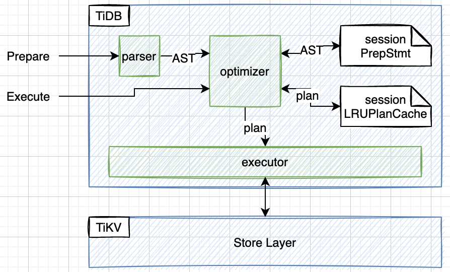
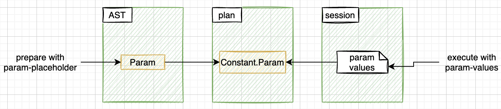

# Plan Cache

TiDB supports execution plan caching for `Prepare` and `Execute` queries. By using cached plan, TiDB can skip the optimization phase and then gain some performance benefits.

The flow of handling `Prepare` and `Execution` is shown below:


There still are some limitations about TiDB plan cache, and please see [the TiDB Plan Cache Doc](https://docs.pingcap.com/tidb/stable/sql-prepare-plan-cache) for more details.

# The flow of handling Prepare statement 

The flow of handling `Prepare` statement is not complex, and the main work are below:
1. parse all parameter placeholders, 
2. parse the query into an AST,
3. store them into current session's `PrepareStmtCache`.

The entry function is `clientConn.handleStmtPrepare`, and most work is done in `PrepareExec.Next`.

When storing the statement, TiDB also check the `max_prepared_stmt_count` limitation.

# The flow of handling Execute statement

The flow of handling `Execute` statement is below:
1. parse all execution parameters and get their values,
2. store all parameter values into current session's param-value cache,
3. check whether there is a cached plan for the current statement, and
   1. if such a cached plan exists, then 
      1. rebuild the cached plan, and
      2. run the rebuilt cached plan;
   2. else 
      1. optimize the cached AST with current parameters and get a new plan,
      2. store the new plan into current session's plan cache,
      3. run the new plan.

The entry function of handling `Execute` statement is `clientConn.handleStmtExecution`, and most work is done in `Execute.getPhysicalPlan`.

# The Paramater Maker

This section explain how TiDB handle parameters and propagate them into the execution plan when processing.



As shown above, when handling a `Prepare` statement with param-placeholders, all these placeholders are parsed into particular AST nodes `ParamMarkerExpr`.

And then when handling an `Execute` statement with parm-values, first all param-values are parsed and stored into current session's param-value cache. Then optimize the AST and convert all `ParamMakerExpr` to particular `Constant` which contain references to their corresponding param-values in the session's cache.

When processing the plan and evaluating the `Constant`, the `Constant` just returns the corresponding param-value stored in current session.

```go
// GetUserVar returns the corresponding user variable presented in the `EXECUTE` statement or `COM_EXECUTE` command.
func (d *ParamMarker) GetUserVar() types.Datum {
	sessionVars := d.ctx.GetSessionVars()
	return sessionVars.PreparedParams[d.order]
}
```

# Plan rebuilding
TODO