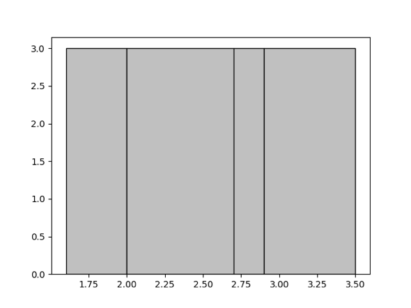
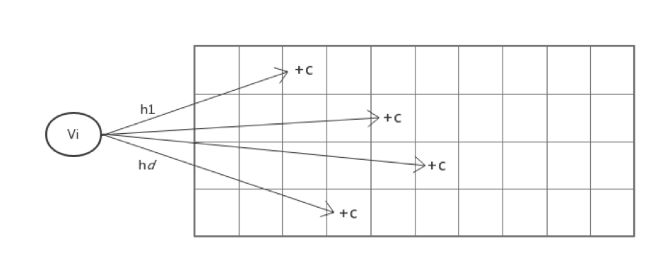

# Table Statistics

Like most commercial databases, TiDB query optimization incorporates a cost-based optimizer that relies on the statistics of the database data to make an optimal query plan. Therefore, the statistics play a key role in TiDB for the optimizer to choose, e.g., the right index for table access or the right join method between the index nested loop join and hash join, and many more scenarios for an optimal query execution plan.

In this chapter, we will introduce different types of statistics being used in TiDB, the corresponding data structure, how TiDB collects and maintains them, as well as how the TiDB optimizer uses these statistics in the optimization process. Given the space limit, we will not cover all the implementation details. However, the corresponding code modules will be pointed out as much as possible. Please also note that as TiDB and its optimizer evolve over time, some of these statistics and their application may also have evolved or been modified.

## Types of TiDB statistics

Among many types of statistics commonly used by databases, TiDB mainly uses three types of them: histogram, top-n values (a.k.a, MFV or most frequent values), and count-min sketch (CM sketch). We will briefly introduce each of these statistics first.

### Histogram

Histogram splits the data into a number of buckets and maintains some information to describe a bucket, such as the number of records in the bucket. It is widely used in many RDBMS to estimate a range.

Among two commonly used histogram strategies, equal-depth and equal-width, we choose the equal-depth histogram for it has a better guarantee of worst case error rate compared to that of the equal-width histogram. You can refer to the paper [Accurate estimation of the number of tuples satisfying a condition](https://dl.acm.org/citation.cfm?id=602294) for more information. With the equal-depth histogram, the number of values in each bucket is to be as equal as possible. For example, to split the given record set of `1.6, 1.9, 1.9, 2.0, 2.4, 2.6, 2.7, 2.7, 2.8, 2.9, 3.4, 3.5` into 4 buckets, the final buckets would look like `[1.6, 1.9], [2.0, 2.6], [2.7, 2.8], [2.9, 3.5]`.	Thus the depth, (a.k.a. the number of records) of each bucket is 3, as shown in the following graph.



### Count-Min Sketch 

The Count-Min Sketch (CM sketch) is a data structure used for query cardinality estimation for the equal predicate, or join, etc., and provides strong accuracy guarantees. Since its introduction in 2003 in the paper [An improved data stream summary: The count-min sketch and its applications](http://dimacs.rutgers.edu/~graham/pubs/papers/cm-full.pdf), it has gained widespread use given its simplicity of construction and use.

CM sketch maintains an array of `d*w` counts, and for each value, maps it to a column in each row using `d` separate hash functions and modifies the count value at those `d` positions. This is shown in the following figure.



This way, when querying how many times a value appears, the d hash functions are still used to find the position mapped to in each row, and the minimum of these d values is used as the estimate. 

**Please note that CM sketch is not used as default statistics since version 5.1 given the increasing concerns on estimation bias under the scenarios with large distinct values of a column.**
### Top-N Value (Most Frequent Value)

The CM sketch would encounter severe hash collisions when the dataset grows while the histogram has its limit to estimate the selectivity of equal predicates. Thus we extract the Top-N value (a.k.a., the most frequent value) of the dataset out of the histogram to improve the accuracy of the estimation of an equal predicate. Here, the top-n statistics are stored as a pair of `(value, cnt)`. For example, for a dataset `1, 1, 1, 1, 1, 1, 1, 2, 2, 3, 4, 4, 5, 6, 7`. if n of top-n is 1, the top-n value pair will be `[(1, 7)]`, and the rest of the histogram is constructed using the remaining data `2, 2, 3, 4, 4, 5, 6, 7`. You may refer to the paper [Synopses for Massive Data: Samples, Histograms, Wavelets, Sketches](https://dl.acm.org/doi/10.1561/1900000004) for additional information.

## Statistics Construction

When the `analyze` command is executed, TiDB will collect the histogram, CM sketch, and top-n values statistics. During the execution of `analyze` command, the columns and indexes that need to be analyzed are divided into different tasks in [builder.go](https://github.com/pingcap/tidb/blob/466f6e77b6b01f09443043f75156de4ca2892141/executor/builder.go#L2459), and then the tasks are pushed down to TiKV for execution in [analyze.go](https://github.com/pingcap/tidb/blob/466f6e77b6b01f09443043f75156de4ca2892141/executor/analyze.go). Here we will focus on the construction of histograms as an example.

### Construction of column histogram

When constructing a column histogram, sampling will be performed first, and then the histogram will be constructed. The detailed steps are shown as follows.

In the [collect](https://github.com/pingcap/tidb/blob/466f6e77b6b01f09443043f75156de4ca2892141/statistics/sample.go#L228) function, we implemented the reservoir sampling algorithm to generate a uniform sampling set. Since its principle and code are relatively simple, it will not be introduced here.

After sampling, in [BuildColumn](https://github.com/pingcap/tidb/blob/466f6e77b6b01f09443043f75156de4ca2892141/statistics/builder.go#L210), we implement the construction of column histogram. The samples are sorted first, then the height of each bucket is determined, and followed by traversing each value `v` sequentially:

* If `v` is equal to the previous value, then put `v` in the same bucket as the previous value, regardless of whether the bucket is full or not so that each value can only exist in one bucket.
* If it is not equal to the previous value, then check whether the current bucket is full. If bucket still has room to store a new item, put `v` directly into the current bucket, and use [updateLastBucket](https://github.com/pingcap/tidb/blob/466f6e77b6b01f09443043f75156de4ca2892141/statistics/histogram.go#L225) to change the upper bound and depth of the bucket.
- Otherwise, use [AppendBucket](https://github.com/pingcap/tidb/blob/466f6e77b6b01f09443043f75156de4ca2892141/statistics/histogram.go#L214) to put in a new bucket.

> You can find how we extract the top-n values then build the histogram in [BuildHistAndTopN](https://github.com/pingcap/tidb/blob/466f6e77b6b01f09443043f75156de4ca2892141/statistics/builder.go#L215).

### Construction of the indexed histogram

When constructing the index column histogram, we use [SortedBuilder](https://github.com/pingcap/tidb/blob/466f6e77b6b01f09443043f75156de4ca2892141/statistics/builder.go#L28) to maintain the intermediate state of the building process. Since the number of rows of data cannot be known in advance, the depth of each bucket cannot be determined. However, since the data in the index column is already ordered, we set the initial depth of each bucket to 1 in [NewSortedBuilder](https://github.com/pingcap/tidb/blob/466f6e77b6b01f09443043f75156de4ca2892141/statistics/builder.go#L44). For each piece of data, [Iterate](https://github.com/pingcap/tidb/blob/466f6e77b6b01f09443043f75156de4ca2892141/statistics/builder.go#L56) will insert the data in a similar way when constructing a column histogram. If at a certain point, the number of required buckets exceeds the current bucket number, then use [mergeBucket](https://github.com/pingcap/tidb/blob/466f6e77b6b01f09443043f75156de4ca2892141/statistics/histogram.go#L532) to merge every two previous buckets into one, double the bucket depth, and then continue to insert.

After collecting the histograms separately established on each Region, we also need to merge the histograms on each Region with [MergeHistogram](https://github.com/pingcap/tidb/blob/466f6e77b6b01f09443043f75156de4ca2892141/statistics/histogram.go#L761). In this function:

* In order to ensure that each value only appears in one bucket, we deal with the problem of the buckets at the junction, that is, if the upper and lower bounds of the two buckets at the junction are [equal](https://github.com/pingcap/tidb/blob/466f6e77b6b01f09443043f75156de4ca2892141/statistics/histogram.go#L775), then the two buckets need to be merged first;
* Before actual merging, we [adjust](https://github.com/pingcap/tidb/blob/466f6e77b6b01f09443043f75156de4ca2892141/statistics/histogram.go#L795-L806) the average bucket depth of the two histograms to be approximately equal;
* If the number of buckets exceeds the limit after the histogram is merged, then the two adjacent buckets are [merged](https://github.com/pingcap/tidb/blob/466f6e77b6b01f09443043f75156de4ca2892141/statistics/histogram.go#L814) into one.

## Statistics maintenance

From version 2.0, TiDB has introduced a dynamic update mechanism, which can dynamically adjust statistics based on the results of the query. In addition, from version 4.0, we have introduced the `auto analyze` function, which can automatically trigger the collection of (incremental) statistics based on the percentage of table data change. 

As data changes significantly, the settings of statistics collection may need to be modified accordingly, too. For example, the histogram needs to adjust the bucket height and the boundaries of the bucket; and the CM Sketch needs to adjust the count array so that the estimated value is equal to the result of the query.

What needs to be pointed out here is that dynamically adjusting statistics based on query results is turned off by default in version 4.0, and will be revisited for a possible redesign in future versions.

## The application of the statistics

### Estimation

Query filtering conditions are often used in query statements to filter out certain data. Thus the main function to exploit statistics is to estimate the number of data after applying these filter conditions so that the optimizer may choose the optimal execution plan based on those estimates. We will introduce two main types of estimation for range and point filtering.

#### Range estimation

For a query that results in a range of data sets on a particular column, we choose the histogram for estimation.

In the previous introduction of the equal-depth histogram, an example of a histogram is given containing four buckets `[1.6, 1.9], [2.0, 2.6], [2.7, 2.8], [2.9, 3.5]`, all of which have a bucket depth of 3. Suppose we have such a histogram, and we want to know how many values fall in the interval `[1.7, 2.8]`. If we put this interval on the histogram, we can see that two buckets are completely covered, namely bucket `[2.0, 2.6]` and bucket `[2.7, 2.8]`, so there are 6 values in the interval `[2.0, 2.8]`. However, the first bucket is only partially covered, so the problem becomes how to estimate the number of values in the interval `[1.7, 1.9]`. When we already know that there are 3 values in the interval `[1.6, 1.9]`, how can we estimate how many values are in `[1.7, 1.9]`? A common approach is to assume that the range is continuous and uniform, so we can estimate the range as a proportion of the bucket, i.e. `(1.9 - 1.7) / (1.9 - 1.6) * 3 = 2`.

Another question to ask here when applying the interpolation ratio to estimate is what about other data types, say string types, as the previous example uses numerical type which is easy? One way is to map strings to numbers and then calculate the ratio, see [statistics/scalar.go](https://github.com/pingcap/tidb/blob/master/statistics/scalar.go) for details. We can see that this mapping is not suitable for multi-column cases.

#### Point estimation

For a query with equal predicate on a column, the histogram may not work well to estimate the cardinality on a certain value. The common way to estimate is to assume uniform distribution of all values that each value appears an equal number of times, so that `(total number of rows/number of distinct values)` can be used to estimate. If it exists, CM sketch is used for the estimation of equal-value queries.

Since the result of Count-Min Sketch estimation is not always smaller than the actual value, we choose the Count-Mean-Min Sketch proposed in the paper [New estimation algorithms for streaming data: Count-min can do more](http://webdocs.cs.ualberta.ca/~drafiei/papers/cmm.pdf), which is the same as Count-Min Sketch in the update time, but the difference is with the query time: for each row `i`, if the hash function maps to value `j`, then `(N - CM[i, j]) / (w-1) (N is the total number of inserted values)` is used as the noise generated by other values, so `CM[i,j] - (N - CM[i, j]) / (w-1)` is used as the estimation value for this row. And then, the median of the estimated values for all rows is used as the final estimate.

After the CM sketch is stopped to use from version 5.1, we extract the top-n values out of the histogram. So we [first](https://github.com/pingcap/tidb/blob/466f6e77b6b01f09443043f75156de4ca2892141/statistics/histogram.go#L1105) check whether the value is in the top-n for the point estimation and return the accurate estimate if it's in the top-n. Otherwise, we use `the number of rows in the histogram / the NDV in the histogram` as the estimation result. Since the top-n values are extracted and applied, the accuracy of this case is improved.

It is relatively simple to estimate cardinality on a single column of a query, so we will not go into details here. The code is basically implemented according to the principle of statistics as introduced above. Please refer to [histogram.go/lessRowCount](https://github.com/pingcap/tidb/blob/466f6e77b6b01f09443043f75156de4ca2892141/statistics/histogram.go#L488) and [cmsketch.go/queryValue](https://github.com/pingcap/tidb/blob/466f6e77b6b01f09443043f75156de4ca2892141/statistics/cmsketch.go#L256) for more information.

#### Multi-column estimation

The above two subsections describe how we estimate query conditions on a single column, but actual query statements often contain multiple query conditions on multiple columns, so we need to consider how to handle the multi-column case. In TiDB, the `Selectivity` function in [selectivity.go](https://github.com/pingcap/tidb/blob/master/statistics/selectivity.go) implements this functionality, and it is the most important interface to the optimizer provided by the statistics module.

When dealing with query conditions on multiple columns, a common practice is to assume that the different columns are independent of each other, so we just multiply the selectivity among the different columns. However, for filter conditions on an index that can be used to construct a range of index scans, i.e., for an index like `(a, b, c)` and the conditions like `(a = 1 and b = 1 and c < 5) or (a = 1 and b = 1)`, the selectivity is estimated by the index's statistics using the method mentioned earlier so that there is no need to assume that the columns are independent of each other.

Therefore, one of the most important tasks of [`Selectivity`](https://github.com/pingcap/tidb/blob/466f6e77b6b01f09443043f75156de4ca2892141/statistics/selectivity.go#L176) is to divide all the query conditions into as few groups as possible so that the conditions in each group can be estimated using the statistics on a column or index. Thus we can make as few assumptions of independence as possible.

We use a simple greedy algorithm to group conditions. We always choose the index or column which covers the most remaining filters and remove these filters from the list. Then go into the next round until all filters are covered. The last step is to do the estimation using the statistics on each column and each index as mentioned before and combine them with the independence assumption as the final result.

It should be noted that we divide the statistics of a single column into [three categories](https://github.com/pingcap/tidb/blob/466f6e77b6b01f09443043f75156de4ca2892141/statistics/selectivity.go#L53): `indexType` is the index column, `pkType` is the primary key of the Int type, and `colType` is the ordinary column type. If a condition can be covered by multiple types of statistics at the same time, then We will choose pkType or indexType first. This is because we build the histogram of the index use full data and build the histogram of the column just using the sampling data in the version before 5.1.

The above two subsections describe how we estimate query conditions on a single column, but actual query statements often contain multiple query conditions on multiple columns, so we need to consider how to handle the multi-column case. In TiDB, the Selectivity function implements this functionality, and it is the most important interface to the optimizer provided by the statistics information module.

In Selectivity, there are the following steps:

 * [getMaskAndRange](https://github.com/pingcap/tidb/blob/466f6e77b6b01f09443043f75156de4ca2892141/statistics/selectivity.go#L363) calculates the filter conditions that can be covered for each column and each index, uses an int64 as a bitset, and sets the bit position of the filter conditions that can be covered by the column to 1.
* Next, in [getUsableSetsByGreedy](https://github.com/pingcap/tidb/blob/466f6e77b6b01f09443043f75156de4ca2892141/statistics/selectivity.go#L404), select as few bitsets as possible to cover as many filter conditions as possible. Every time in the unused bitset, select a filter condition that can cover up to the uncovered. And if the same number of filter conditions can be covered, we will give preference to `pkType` or `indexType`.
* Use the method mentioned above to estimate the selectivity on each column and each index, and use the independence assumption to combine them as the final result.

## Summary

The collection and maintenance of statistics are one of the core functions of the database. And for the cost-based query optimizer, the accuracy of statistics directly affects the optimizer's decision and, therefore, the query performance. In distributed databases, collecting statistics is not much different from a single node database. However, it is more challenging to maintain the statistics, e.g., how to maintain accurate and up-to-date statistics in the case of multi-node updates.

For dynamic updating of histograms, the industry generally has two approaches.

* For each addition or deletion, update the corresponding bucket depth. When its depth is too high, a bucket is split into two equal width buckets, although it is hard to determine the splitting point accurately and may cause estimation error.
* Using the actual number obtained from the executed query to adjust the histogram with feedback, assuming that the error contributed by all buckets is uniform, and uses the continuous value assumption to adjust all the buckets involved. However, the assumption of uniformity of errors may not hold and cause problems. For example, when a newly inserted value is larger than the maximum value of the histogram, it will spread the error caused by the newly inserted value to the whole histogram, which causes estimation errors.

Currently, TiDB's statistics are still dominated by single-column statistics. To reduce the use of independence assumptions, TiDB will further explore the collection and maintenance of multi-column statistics, as well as other synopses to provide more accurate statistics for the optimizer.


## Appendix

Below is the related code structure from the TiDB repository.

```
tidb
.
│
...
├── executor
│   │
│   ...
│   ├── analyze.go
│   │
│   ...
...
├── statistics
│   ├── analyze.go
│   ├── analyze_jobs.go
│   ├── analyze_jobs_serial_test.go
│   ├── builder.go
│   ├── cmsketch.go
│   ├── cmsketch_test.go
│   ├── estimate.go
│   ├── feedback.go
│   ├── feedback_test.go
│   ├── fmsketch.go
│   ├── fmsketch_test.go
│   ├── handle
│   │   ├── bootstrap.go
│   │   ├── ddl.go
│   │   ├── ddl_test.go
│   │   ├── dump.go
│   │   ├── dump_test.go
│   │   ├── gc.go
│   │   ├── gc_test.go
│   │   ├── handle.go
│   │   ├── handle_test.go
│   │   ├── main_test.go
│   │   ├── update.go
│   │   ├── update_list_test.go
│   │   └── update_test.go
│   ├── histogram.go
│   ├── histogram_test.go
│   ├── integration_test.go
│   ├── main_test.go
│   ├── row_sampler.go
│   ├── sample.go
│   ├── sample_test.go
│   ├── scalar.go
│   ├── scalar_test.go
│   ├── selectivity.go
│   ├── selectivity_test.go
│   ├── statistics_test.go
│   ├── table.go
│   └── testdata
│       ├── integration_suite_in.json
│       ├── integration_suite_out.json
│       ├── stats_suite_in.json
│       └── stats_suite_out.json
...
├── util
│   │
│   ...
│   ├── ranger
│   │   ├── checker.go
│   │   ├── detacher.go
│   │   ├── main_test.go
│   │   ├── points.go
│   │   ├── ranger.go
│   │   ├── ranger_test.go
│   │   ├── testdata
│   │   │   ├── ranger_suite_in.json
│   │   │   └── ranger_suite_out.json
│   │   ├── types.go
│   │   └── types_test.go
... ...
```

The `exeutor/analyze.go` places how the ANALYZE executes and save to the TiKV storage. If you want to know the detailed data structure and how they are maintained, you can go thourgh the `statistics` directory. e.g. You can find how we define and maintain the histogram strcuture in `statistics/histogram.go`.

And for the TiKV repository, you can look into the directory `src/coprocessor/statistics/`.