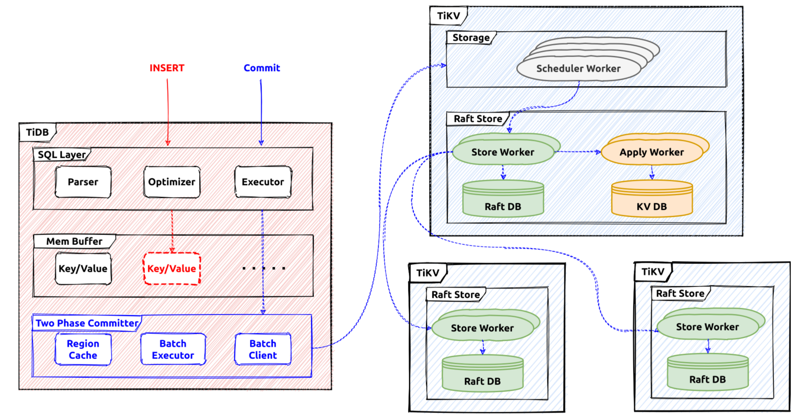

# Transaction

The transaction engine in TiDB is responsible to provide `ACID` guarantee for all the read and write requests. It consists of the client/coordinator part in `TiDB` repository and the server/participant part in `TiKV` repository. This document is mainly about the `TiDB` part.

# The Architecture

In `TiDB` the transaction write flow is like this:



After the transaction is started in a session, all the reads and writes will use a snapshot to fetch data, and the written content will be buffered in the memory
of the transaction. When the `commit` statement is received from the client, the `percolator` protocol will be used to commit these changes to the storage system.

# The Interface

In `TiDB`, the [`Transaction`](https://github.com/pingcap/tidb/blob/af70762cd52519f025daa5e869ba37465a7fb311/kv/kv.go#L181) interface defines the commonly used transaction operations.

```go
type Transaction interface {
  ...
	// Commit commits the transaction operations to KV store.
	Commit(context.Context) error
	// Rollback undoes the transaction operations to KV store.
	Rollback() error
	// LockKeys tries to lock the entries with the keys in KV store.
	// Will block until all keys are locked successfully or an error occurs.
	LockKeys(ctx context.Context, lockCtx *LockCtx, keys ...Key) error
	// SetOption sets an option with a value, when val is nil, uses the default
	// value of this option.
	SetOption(opt int, val interface{})
	// GetOption returns the option
	GetOption(opt int) interface{}
	...
	// StartTS returns the transaction start timestamp.
	StartTS() uint64
	// Valid returns if the transaction is valid.
	// A transaction become invalid after commit or rollback.
	Valid() bool
	// GetMemBuffer return the MemBuffer binding to this transaction.
	GetMemBuffer() MemBuffer
	// GetSnapshot returns the Snapshot binding to this transaction.
	GetSnapshot() Snapshot
  ...
}
```

These are common interfaces the transaction will provide. For example, `Commit` will be used to commit the current ongoing transaction. The transaction is considered ongoing before the `Commit` operation is triggered. The two-phase commit processing will be used to commit a transaction and it will finally become committed or aborted. 

[LazyTxn](https://github.com/pingcap/tidb/blob/af70762cd52519f025daa5e869ba37465a7fb311/session/txn.go#L50) is a wrapper of the transaction implementations, when the SQL statements are executed using a stand-alone session context, `LazyTxn` will be used to do things like：
- Return the memory buffer for write.
- Set specific operations or flags for the current transaction.
- Return the snapshot of this transaction.
- Commit the current transaction.
- Lock specific keys.
- etc...


# The Statement Execution

Usually, the first thing that will be done executing a statement is to `activate` the related transaction. By default `TiDB` provides the snapshot isolation level, so in each new transaction, a new global strong snapshot will be fetched first before executing statements. In `TiDB` the snapshot is represented by a global TSO which is fetched from the `PD` server, and it acts as the unique identifier for this transaction. After this operation, a transaction is regarded as `activated`.

For the read SQL statements, the [snapshot](https://github.com/pingcap/tidb/blob/af70762cd52519f025daa5e869ba37465a7fb311/store/driver/txn/snapshot.go) will be used to provide a global strong consistent snapshot, all the reads will check data visibility using this snapshot. Most executors will set the timestamp doing the build, and the transaction could be activated by the building process. Some commonly used [snapshot](https://github.com/pingcap/tidb/blob/af70762cd52519f025daa5e869ba37465a7fb311/store/driver/txn/snapshot.go#L40) API:

```go
// BatchGet gets all the keys' value from kv-server and returns a map contains key/value pairs.
// The map will not contain nonexistent keys.
func (s *tikvSnapshot) BatchGet(ctx context.Context, keys []kv.Key) (map[string][]byte, error) {
	data, err := s.KVSnapshot.BatchGet(ctx, toTiKVKeys(keys))
	return data, extractKeyErr(err)
}

// Get gets the value for key k from snapshot.
func (s *tikvSnapshot) Get(ctx context.Context, k kv.Key) ([]byte, error) {
	data, err := s.KVSnapshot.Get(ctx, k)
	return data, extractKeyErr(err)
}
```

For the write SQL statements, they will write data into the transaction memory buffer temporarily until the `commit` operation is triggered. There are 3 main interfaces which will write query data into the memory buffer, here are the [tables](https://github.com/pingcap/tidb/blob/af70762cd52519f025daa5e869ba37465a7fb311/table/table.go#L166) API:

```go
// Table is used to retrieve and modify rows in table.
type Table interface {
	...
	// AddRecord inserts a row which should contain only public columns
	AddRecord(ctx sessionctx.Context, r []types.Datum, opts ...AddRecordOption) (recordID kv.Handle, err error)

	// UpdateRecord updates a row which should contain only writable columns.
	UpdateRecord(ctx context.Context, sctx sessionctx.Context, h kv.Handle, currData, newData []types.Datum, touched []bool) error

	// RemoveRecord removes a row in the table.
	RemoveRecord(ctx sessionctx.Context, h kv.Handle, r []types.Datum) error
	...
}
```

Every statement will use a `staging buffer` during its execution, if it's successful the staging content will be merged into the transaction memory buffer. For example, `AddRecord` will try to write a row into the current statement staging buffer, and the `RemoveRecord` will try to remove a row from the staging statement buffer. The existing transaction memory buffer will not be affected if the statement has failed.

The memory buffer implementation is wrapped in [memBuffer](https://github.com/pingcap/tidb/blob/af70762cd52519f025daa5e869ba37465a7fb311/store/driver/txn/unionstore_driver.go#L27). The internal implementation is `MemDB` [object](https://github.com/tikv/client-go/blob/4fc565e203a99400d0b080a25a93fb860b3b6fd6/internal/unionstore/memdb.go).

The memory buffer is an ordered map and it provides the `staging` and `discard` utilities. For example, the memory content generated by a statement will be discarded if its execution has failed.


# The Two-phase Commit

After the statement execution phase, the `commit` statement will trigger the commit execution for the current transaction. In TiDB the [Percolator](https://tikv.org/deep-dive/distributed-transaction/percolator/) protocol is used as the distributed transaction protocol, it's a two-phase protocol. In the first stage, the transaction coordinator(TiDB server) will try to prewrite all the related keys, if all of them are successful, the transaction coordinator will then commit the primary key, after that the transaction is considered committed successfully, and a success message will be responded to the client. All the other keys will be committed asynchronously.

All the changes in the transaction memory buffer will be converted into [mutations](https://github.com/pingcap/kvproto/blob/dc1709169bb155de3bea6b28c871215387942994/proto/kvrpcpb.proto#L882) which will be used by the two-phase committer. These mutations will be grouped by their region locations, and prewrite requests will be sent to their region leaders.

If all the prewrite requests are processed successfully, the commit request for the primary key will be sent to `TiKV` first. If the primary key commit is successful, the transaction is considered committed and will respond to the client with successful results.

# Summary

This section talks about the brief steps of tranaction processing in the `TiDB` part, and related interfaces and implementations. 
