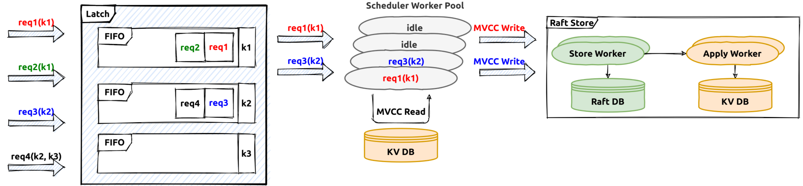

# Transaction In TiKV

The previous [document](./transaction.md) introduces the architecture of the transaction engine and some implementation details in `TiDB` part. This document is mainly about the `TiKV` part.

As described in the previous [docuemnt](./transaction.md), the distributed transaction coordinator is the `tidb-server` which receives and processes the user `COMMIT` query, and the transaction participants are invovled `tikv-servers`.

# Transactional Protocol

Based on the percolator model, the RPC interfaces used in TiDB are described in proto [file](https://github.com/pingcap/kvproto/blob/0f5764a128ad77ccf0a5b0ce0d6e2bfa50a108ce/proto/kvrpcpb.proto#L77). They will be used by the transaction coordinator to drive the whole commit process, for example `Prewrite` will be used to write the lock record in TiKV:
```
message PrewriteRequest {
    Context context = 1;
    // The data to be written to the database.
    repeated Mutation mutations = 2;
    // The client picks one key to be primary (unrelated to the primary key concept in SQL). This
    // key's lock is the source of truth for the state of a transaction. All other locks due to a
    // transaction will point to the primary lock.
    bytes primary_lock = 3;
    // Identifies the transaction being written.
    uint64 start_version = 4;
    uint64 lock_ttl = 5;
    // TiKV can skip some checks, used for speeding up data migration.
    bool skip_constraint_check = 6;
    // For pessimistic transaction, some mutations don't need to be locked, for example, non-unique index key.
    repeated bool is_pessimistic_lock = 7;
    // How many keys this transaction involves in this region.
    uint64 txn_size = 8;
    // For pessimistic transactions only; used to check if a conflict lock is already committed.
    uint64 for_update_ts = 9;
    // If min_commit_ts > 0, this is a large transaction request, the final commit_ts
    // will be inferred from `min_commit_ts`.
    uint64 min_commit_ts = 10;
    // When async commit is enabled, `secondaries` should be set as the key list of all secondary
    // locks if the request prewrites the primary lock.
    bool use_async_commit = 11;
    repeated bytes secondaries = 12;
    // When the transaction involves only one region, it's possible to commit the transaction
    // directly with 1PC protocol.
    bool try_one_pc = 13;
    // The max commit ts is reserved for limiting the commit ts of 1PC or async commit, which can be used to avoid
    // inconsistency with schema change.
    uint64 max_commit_ts = 14;
}
```

The `mutations` are changes made by the transaction, `start_version` is the transaction identifier fetched from PD, `for_update_ts` is used by the pessimistic transactions which will be introduced seperately. The `try_one_pc` field is about committing the transaction using `one-phase` protocol, the `use_async_commit` and `secondaries` will be used if the transaction is committing in the `async-commit` mode, these optimizations will be introduced seperately in other documents.

Besides `prewrite` request, there are some other important request types:
- `pessimistic_lock` [request](https://github.com/pingcap/kvproto/blob/0f5764a128ad77ccf0a5b0ce0d6e2bfa50a108ce/proto/kvrpcpb.proto#L125) is used to lock a key. Note pessimistic locking happens in the transaction execution phase, for example a `select for update` statment will need to pessimistically lock the correspond rows.
- `commit` [request](https://github.com/pingcap/kvproto/blob/0f5764a128ad77ccf0a5b0ce0d6e2bfa50a108ce/proto/kvrpcpb.proto#L268) which is used to commit a key. After commit the write content is visible to other read or write transactions.
- `check_txn_status` [request](https://github.com/pingcap/kvproto/blob/master/proto/kvrpcpb.proto#L206) will be used to check the status of a given transaction, so that it could be decided how to process the conflicts.
- `resolve` [request](https://github.com/pingcap/kvproto/blob/0f5764a128ad77ccf0a5b0ce0d6e2bfa50a108ce/proto/kvrpcpb.proto#L374) will be used to help doing the transaction crash recovery, it will also be introduced in another document in details.
- `check_secondary_locks` [request](https://github.com/pingcap/kvproto/blob/master/proto/kvrpcpb.proto#L247) is a special API, it will be used if the commit mode of the transaction is `async-commit`, it will also be introduced in another document in details.

# Transaction Scheduler



The receiving input transaction requests will be translated into transaction [commands](https://github.com/tikv/tikv/blob/6be3893f7f787b04bf34d99d1369092404ab5cfc/src/storage/txn/commands/mod.rs#L114). Then the transaction [scheduler](https://github.com/tikv/tikv/blob/6be3893f7f787b04bf34d99d1369092404ab5cfc/src/storage/txn/scheduler.rs#L286) will handle these transaction commands, it will first try to fetch the needed key [latches](https://github.com/tikv/tikv/blob/6be3893f7f787b04bf34d99d1369092404ab5cfc/src/storage/txn/latch.rs#L22) (latch is used to sequence all the transaction commands on the same key)，then try to fetch a storage [snapshot](https://github.com/tikv/tikv/blob/6be3893f7f787b04bf34d99d1369092404ab5cfc/components/tikv_kv/src/lib.rs#L191) for the current transaction processing.

The future processing is done in the transaction scheduler thread-pool, usually there will be some tasks like conflict and constraint checks, write mutation generations. For example, the prewrite request processing will need to check if there is already a conflict [lock](https://github.com/tikv/tikv/blob/6be3893f7f787b04bf34d99d1369092404ab5cfc/src/storage/txn/actions/prewrite.rs#L45) or a conflict committed write [record](https://github.com/tikv/tikv/blob/6be3893f7f787b04bf34d99d1369092404ab5cfc/src/storage/txn/actions/prewrite.rs#L59).

# Transaction Log Replication

In TiDB the key space is splitted into different ranges or regions, each region is a raft group and its leader will be responsible for handling its key range related read/write requests. 

After the transaction command processing and there is no error reported, the generated transaction writes will be written into the raft log engine by the region leaders in `raftStore`(raftStore will be introduced in other documents in details). The work flow is like this:


The writes generated by transaction commands will be sent to the raft peer message task queue first, then the raft batch system will poll each raft peer and handle these requests in the raft thread-pool. After all the raft logs are persisted on majority raft group members, they are regarded as `commit`. Then the correspond apply task be delivered to the apply worker pool to apply the actual write contents to the storage engine, after that the transaction command processing is considered successful and the callback will be invoked to response successful results to the RPC client.


# Transaction Record In TiKV

In TiDB a transaction is considered committed only if its primary key lock is committed succesfully(If async commit protocol is not used). The acutal key and value written into storage engine is in the following format:


| CF	| RocksDB Key |	RocksDB Value |
| ---   | --- | --- |
|Lock	 |user_key	 | lock_info |
|Default |{user_key}{start_ts}	| user_value |
|Write	 |{user_key}{commit_ts}	| write_info |

After `prewrite`, the lock correspond records for the transaction will be written into the storage. Read and write conflicts on the "locked" key will need to consider if it's safe to bypass the lock or it must try to resolve the encountered locks. As `commit_ts` is part of the stored key, there could be different historical versions for it, and GC is responsible to clean up all the old versions which will not be needed, GC will be introduced in another document.

# Transaction Recovery

In TiDB the transaction coordinator(in `tidb-server`) is stateless and it will not persist any information. If the transaction coordinator fails for example the `tidb-server` crashes, the transaction context in memory will get lost, and as the coordinator is gone the normal commit processing will stop. How to recover the transaction state and make a decision if it should commit or abort? Actually there is no special mechanism to recover the failed transctions, the recovery is done by other conflict concurrent transactions, or the conflict transactions will help decide the actual states for the failed tranactions. The lock resolve process will be triggered if current ongoing transaction encounters conflicts with other transaction locks doing reads or writes. The whole process will be introduced in other documents in details.

# Transaction Optimizations

Normally the transaction commit will need two pahses, the `prewrite` phase and `commit` phase. Under certain circumstances transaction commit could be done in a single phase for example the generated transaction mutations could be processed by a single region leader. This optimization is called one-phase commit in TiDB. The final transaction status is determined by the commit status of the primary key lock, so the reponse to the client has to wait until the primary key commit has finished. This wait could be saved using the `async-commit` protocol so the latency of commit processing could be reduced. They will both be introduced other documents in details.

# Summary

This section talks about the brief steps of tranaction processing in the TiKV part, and related interfaces, implementations and optimizations.
